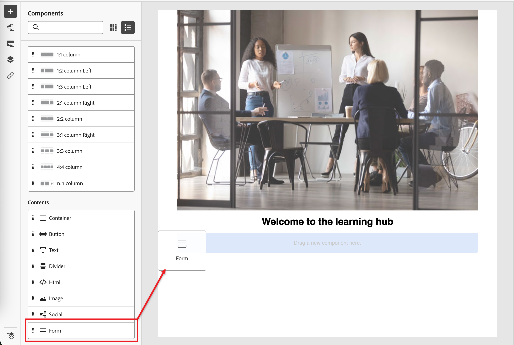

# 컨텐츠 작성 - 양식 추가

양식은 여러 랜딩 페이지 및 랜딩 페이지 템플릿에서 참조할 수 있는 재사용 가능한 구성 요소입니다. 이는 사전 생성되고 신속하게 삽입하여 페이지 디자인을 보다 빠르고 일관되게 만들 수 있는 필드 블록 및 제출 버튼입니다.

다음 예에서는 랜딩 페이지를 디자인할 때 양식을 추가하는 단계에 대해 간략하게 설명합니다.

1. **[!UICONTROL 콘텐츠]** 섹션에서 **[!UICONTROL 양식]** 항목을 페이지 디자인 공간의 구조적 구성 요소에 끌어 놓습니다.

   {width="600"}

   >[!TIP]
   >
   >페이지 내의 전체 수평 레이아웃을 차지하도록 양식을 추가하려면 1:1 열 구조를 추가한 다음 양식을 끌어서 놓습니다.

1. 구성 요소 도구 모음에서 _양식_ 아이콘을 클릭하거나 오른쪽의 **[!UICONTROL 양식 포함]** 속성을 사용하여 게시된 양식을 선택합니다.

   {width="600"}

1. 양식에 대한 기본 **[!UICONTROL 후속 작업 형식]**&#x200B;을(를) 재정의하려면 페이지나 템플릿의 요구 사항에 따라 설정을 변경합니다.

   양식에 대한 _감사 페이지_&#x200B;라고도 하며, 이 설정은 방문자가 양식을 제출할 때 수행되는 작업을 결정합니다.

   * **[!UICONTROL 페이지에서 유지]** - 양식을 제출할 때 방문자를 동일한 페이지에 유지하려면 이 옵션을 선택하십시오.

   * **[!UICONTROL 랜딩 페이지]** - 다른 랜딩 페이지를 후속 페이지로 선택하려면 이 옵션을 선택하십시오.

   * **[!UICONTROL 외부 URL]** - URL을 후속 페이지로 지정하려면 이 옵션을 선택하십시오. 방문자가 양식을 제출하면 브라우저가 지정된 URL을 로드합니다.

     >[!TIP]
     >
     >파일을 다운로드하는 데 양식을 사용하려는 경우 호스팅된 파일의 URL을 지정할 수 있습니다. 이 구성에서 제출 버튼은 다운로드 버튼으로 작동합니다.

     {width="280"}

1. 장치 유형별로 양식 표시를 제한하려면 **[!UICONTROL 표시 옵션]** 설정을 변경합니다.

   * **[!UICONTROL 데스크톱 장치에서만 표시]**
   * **[!UICONTROL 모바일 장치에서만 표시]**
   * **[!UICONTROL 모든 장치에서 표시]**(기본값)

1. 필요한 경우 오른쪽 패널의 **[!UICONTROL 스타일]** 탭을 선택하여 페이지 내에서 양식 여백을 설정합니다.
