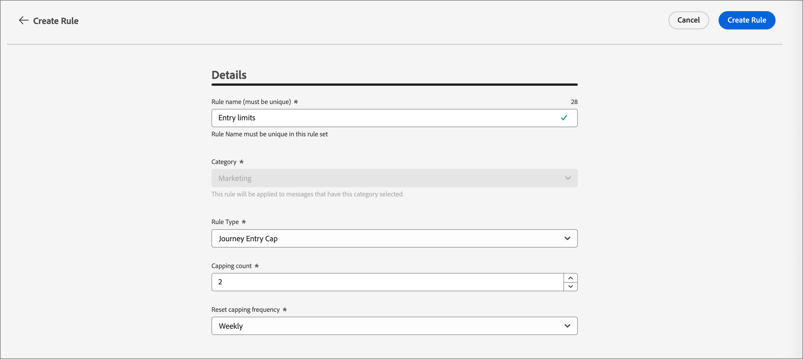

# 비즈니스 규칙 {#business-rules}

>[!CONTEXTUALHELP]
>id="ajo-b2b-prime_business_rules_rule_sets"
>title="규칙 세트"
>abstract="규칙 세트를 사용하여 빈도 상한 설정 또는 방해 금지 시간대 규칙을 다양한 유형의 마케팅 커뮤니케이션에 적용합니다. 빈도 상한 설정 규칙에 따라 대상자의 일부로 향하는 여정을 제외하는 규칙 세트를 만들 수도 있습니다."

비즈니스 규칙을 사용하면 마케터가 필요에 따라 규칙을 이메일에 적용할 수 있도록 조직에서 여러 규칙을 정의하고 규칙 세트로 그룹화할 수 있습니다. 이를 통해 특정 시간대 내에 고객이 입력할 수 있는 여정 수와 빈도를 제한하거나 통신 유형에 따라 사용자가 메시지를 받는 빈도를 제어할 수 있는 세부 기간을 개선할 수 있습니다.

다음 두 가지 유형의 규칙 세트를 만들 수 있습니다.

* **채널** 규칙 집합은 통신 채널에 규칙을 적용합니다. 이를 통해 다음을 설정할 수 있습니다.

  * **빈도 제한 규칙** - 예: *하루에 두 개 이상의 전자 메일, SMS, 푸시, DM 또는 WhatsApp 통신을 보내지 마십시오.*
  * **방해 금지 시간 규칙** - 예: *오전 8시~오후 9시 타임슬롯 이외의 시간에 전자 메일 메시지를 보내지 마십시오.*

* **여정** 규칙 집합은 시작 및 동시성 최대 가용량 규칙을 여정에 적용합니다. (Beta 릴리스에서는 아직 지원되지 않습니다.)

>[!PREREQUISITES]
>
>비즈니스 규칙을 사용하여 작업하려면 다음 CX 엔터프라이즈 권한이 필요합니다.
>
>* **[!UICONTROL 빈도 규칙 보기]**: 비즈니스 규칙에 액세스하고 봅니다.
>* **[!UICONTROL 빈도 규칙 관리]**: 비즈니스 규칙을 만들거나 편집하거나 삭제합니다.

## 규칙 세트 액세스 및 관리 {#access-manage}

기존의 모든 규칙 집합에 액세스하려면 왼쪽 탐색에서 **[!UICONTROL 관리]**&#x200B;를 확장하고 **[!UICONTROL 비즈니스 규칙]**&#x200B;을 선택하십시오.

{width="800" zoomable="yes"}

### 글로벌 및 사용자 지정 규칙 세트 {#global-custom}

_규칙 집합_&#x200B;에 처음 액세스할 때 기본 규칙 집합이 미리 만들어져 활성화됩니다. **_[!UICONTROL 전역 규칙 집합]_**. 사용자가 하나 또는 여러 채널에서 메시지를 받는 빈도를 제어하기 위해 적용할 수 있는 전역 규칙 집합입니다. 이 규칙 세트에 정의된 규칙은 선택한 모든 채널에 적용됩니다.

{width="700" zoomable="yes"}

이 기본 규칙 세트 외에도 고유한 사용자 지정 규칙 세트를 만들고 이를 여정 또는 채널 노드에 적용하여 특정 최대 가용량 및 자동 시간 규칙을 사용할 수 있습니다.

### 규칙 세트 열기 {#open-rule-set}

규칙 세트 이름을 눌러 해당 규칙 정의를 보고 편집합니다. 해당 규칙 세트에 포함된 모든 규칙이 나열됩니다. 오른쪽 상단의 _추가 메뉴_( **...** )를 사용하여 활성화하거나 비활성화하거나 삭제합니다.

{width="700" zoomable="yes"}

### 규칙 편집 {#edit-rules}

규칙 세트의 초안 규칙의 경우 규칙 이름 옆에 있는 _편집_(  ) 아이콘을 클릭하여 규칙 설정을 편집합니다. _추가 메뉴_( **...**) 아이콘을 클릭하여 규칙을 활성화하거나 삭제할 수도 있습니다.

{width="500" zoomable="yes"}

규칙을 비활성화하려면 활성 규칙 옆에 있는 _비활성화_( ) 아이콘을 클릭합니다. 확인 대화 상자에서 **[!UICONTROL 비활성화]**&#x200B;를 클릭합니다. 상태가 **_[!UICONTROL 비활성]_**(으)로 변경되며 향후 메시지 실행에 규칙이 적용되지 않습니다. 현재 실행 중인 모든 메시지는 영향을 받지 않습니다.

>[!NOTE]
>
>규칙 또는 규칙 세트를 비활성화하는 것은 개별 프로필의 카운트에 영향을 주거나 재설정되지 않습니다.

## 사용자 정의 규칙 세트 만들기 및 활성화 {#create}

>[!CONTEXTUALHELP]
>id="ajo-b2b-prime_rule_set_domain"
>title="규칙 세트 도메인"
>abstract="규칙 세트를 만들 때는 규칙 세트 내의 규칙이 통신 채널 또는 여정에 특정한 상한 설정 규칙을 적용할지 지정해야 합니다."

>[!CONTEXTUALHELP]
>id="ajo-b2b-prime_rule_sets_category"
>title="메시지 규칙 카테고리 선택"
>abstract="활성화되어 메시지에 적용되면 선택한 카테고리와 일치하는 모든 빈도 규칙은 이 메시지에 자동으로 적용됩니다. 현재 마케팅 카테고리만 사용할 수 있습니다."

>[!CONTEXTUALHELP]
>id="ajob2b-prime_rule_type"
>title="규칙 유형"
>abstract="채널 규칙 세트에 적용할 규칙 유형을 선택하십시오. **빈도 상한 설정** 유형을 사용하여 커뮤니케이션 채널에 상한 설정 규칙을 적용합니다. 예를 들어 하루에 1회 이상의 이메일 또는 SMS 커뮤니케이션을 보내지 않도록 합니다. **방해 금지 시간대**&#x200B;를 선택하여 시간 기반 제외 규칙을 정의하면, 특정 시간대에는 메시지가 전송되지 않도록 할 수 있습니다.   "

>[!CONTEXTUALHELP]
>id="ajo-b2b-prime_rule_sets_duration"
>title="캡핑 빈도 재설정"
>abstract="캡핑 카운터 재설정에 사용되는 캘린더 기간(시간별, 일별, 주별 또는 월별)을 선택합니다. 카운터는 새 기간이 시작될 때마다 0으로 자동 재설정됩니다."

>[!CONTEXTUALHELP]
>id="ajo-b2b-prime_rule_set_rule_capping"
>title="규칙 상한 설정"
>abstract="규칙에 대한 상한을 설정합니다. 규칙 세트 도메인과 규칙 유형 필드에서의 선택에 따라 이 필드는 프로필로 보낼 수 있는 최대 메시지 수 또는 프로필이 동시에 입력되거나 등록될 수 있는 최대 여정 수를 정의할 수 있습니다."

>[!CONTEXTUALHELP]
>id="ajo-b2b-prime_journey_business_rules"
>title="규칙 세트"
>abstract="사용자 정의 액션에 적용할 규칙 세트를 선택합니다."

>[!NOTE]
>
>채널 도메인에 대해 최대 10개의 규칙 세트와 여정 도메인에 대해 최대 10개의 규칙 세트를 만들 수 있습니다(총 20개의 규칙 세트).

1. 왼쪽 탐색에서 **[!UICONTROL 관리]**&#x200B;를 확장하고 **[!UICONTROL 비즈니스 규칙]**&#x200B;을 선택합니다.

1. _[!UICONTROL 규칙 집합]_ 목록 페이지에서 오른쪽 상단의 **[!UICONTROL 규칙 집합 만들기]**&#x200B;를 클릭합니다.

   {width="400"}

1. 규칙 집합에 고유한 **[!UICONTROL 이름]**(필수)을 입력하고 **[!UICONTROL 설명]**(선택 사항)을 추가하십시오.

1. 규칙 집합 **[!UICONTROL 도메인]**&#x200B;을(를) 선택하십시오.

   * **[!UICONTROL 채널]** - 최대 가용량 규칙 또는 자동 시간 규칙을 통신 채널에 적용합니다.
   * **[!UICONTROL 여정]** - 여정에 시작 및 동시성 제한 규칙을 적용합니다.

   >[!IMPORTANT]
   >
   >여정 규칙은 이 Beta 릴리스에서 아직 지원되지 않습니다.

1. **[!UICONTROL 저장]**&#x200B;을 클릭합니다.

   {width="700" zoomable="yes"}

### 규칙 추가 {#add-rules}

규칙 세트를 만든 후 포함할 각 규칙을 추가합니다.

1. **[!UICONTROL 규칙 추가]**&#x200B;를 클릭합니다.

1. 목적에 따라 규칙 매개 변수를 구성합니다.

   규칙에 사용할 수 있는 매개 변수는 만들 때 선택한 규칙 세트 도메인에 따라 다릅니다.

   {width="700" zoomable="yes"}

   여정 및 채널 규칙 구성에 대한 자세한 내용은 다음 섹션에서 확인할 수 있습니다.

   <!-- * [Journey capping](../conflict-prioritization/journey-capping.md) -->
   * [채널 및 커뮤니케이션 유형별 빈도 캡핑](#frequency-capping)
   * [방해 금지 시간](#quiet-hours)

1. **[!UICONTROL 규칙 만들기]**&#x200B;를 클릭하여 규칙 만들기를 확인합니다.

   새 규칙이 _초안_ 상태로 규칙 집합에 나열됩니다.

1. 위의 단계를 반복하여 규칙 세트에 필요한 수만큼 규칙을 추가합니다.

   규칙이 만들어지면 _[!UICONTROL 초안]_ 상태가 되며 아직 메시지에 영향을 줄 수 없습니다.

   {width="700" zoomable="yes"}

1. 규칙 집합에 대한 규칙을 활성화하려면 규칙 이름 옆에 있는 _추가 메뉴_( **...** ) 아이콘을 클릭하고 **[!UICONTROL 활성화]**&#x200B;를 선택합니다.

   확인 대화 상자에서 **[!UICONTROL 활성화]**&#x200B;를 클릭합니다.

### 규칙 세트 활성화 {#activate-rule-set}

규칙 세트를 활성화하면 여정 또는 채널 메시지에 적용할 수 있습니다. 규칙 세트가 활성 상태이면 더 이상 규칙을 추가할 수 없습니다. 비활성화하여 변경한 다음 다시 활성화할 수 있습니다.

1. _규칙 집합_ 목록 페이지에서 규칙 집합을 엽니다.

1. 오른쪽 상단의 _추가 메뉴_( **...** )를 클릭하고 **[!UICONTROL 규칙 집합 활성화]**&#x200B;를 선택합니다.

   {width="700" zoomable="yes"}

1. 확인 대화 상자에서 **[!UICONTROL 활성화]**&#x200B;를 클릭합니다.

   >[!NOTE]
   >
   >규칙 또는 규칙 세트가 완전히 활성화되려면 최대 10분이 걸릴 수 있습니다. 규칙을 적용하려면 메시지를 수정하거나 여정을 다시 게시할 필요가 없습니다.

규칙 세트에 대한 여정 설정에 따라 메시지 또는 도메인에 활성 규칙 세트를 적용할 수 있습니다.

## 채널별 빈도 설정 {#frequency-capping}

프로필에서 수신하는 메시지 수를 제한하고 유사한 커뮤니케이션으로 고객을 압도하지 않도록 채널 및 커뮤니케이션 유형별로 빈도 상한을 설정합니다. 채널 규칙 세트는 최대 가용량 규칙을 통신 채널에 적용합니다. 예를 들어 하루에 1회 이상의 이메일 또는 SMS 커뮤니케이션을 보내지 않도록 합니다.

채널 규칙 세트를 활용하면 통신 유형별로 빈도 상한을 설정하여 유사한 메시지가 있는 고객을 오버로드할 수 있습니다. 예를 들어 고객에게 전송되는 _프로모션 커뮤니케이션_&#x200B;의 수를 제한하는 규칙 세트와 고객에게 전송되는 _뉴스레터_&#x200B;의 수를 제한하는 규칙 세트를 만들 수 있습니다. 그런 다음 프로모션 커뮤니케이션 또는 뉴스레터 규칙 세트를 적용하도록 선택할 수 있습니다.

>[!IMPORTANT]
>
>여정 수준 캡핑이 올바르게 작동하도록 하려면 채널을 빌드하는 동안 우선 순위가 가장 높은 네임스페이스를 선택해야 합니다. [플랫폼 ID 서비스 안내서](https://experienceleague.adobe.com/ko/docs/experience-platform/identity/features/identity-graph-linking-rules/namespace-priority){target="_blank"}에서 네임스페이스 우선 순위에 대해 자세히 알아보십시오.

### 채널 캡핑 규칙 만들기 {#create-capping-rule}

>[!CONTEXTUALHELP]
>id="ajo-b2b-prime_rule_sets_channel"
>title="규칙이 적용되는 채널 정의"
>abstract="하나 이상의 채널을 선택합니다. 상한 설정은 채널에서 총 횟수로 적용됩니다."

1. 최대 가용량 규칙을 추가할 채널 규칙 세트를 선택하거나 새 채널 규칙 세트를 만듭니다.

1. 규칙 집합 페이지에서 **[!UICONTROL 규칙 추가]**&#x200B;를 클릭하고 규칙의 고유한 이름을 입력합니다.

   >[!NOTE]
   >
   > _[!UICONTROL Category]_ 필드는 규칙의 메시징 범주를 지정합니다. 현재 이 필드는 읽기 전용이며 **[!UICONTROL 마케팅]** 범주만 사용할 수 있습니다.

1. _[!UICONTROL 규칙 유형]_&#x200B;에 대해 **[!UICONTROL 채널 제한]**&#x200B;을 선택하세요.

   {width="700" zoomable="yes"}

1. **[!UICONTROL 최대 가용량]** 필드에서 규칙의 최대 가용량 값을 설정합니다.

   이 값은 다른 필드에서 선택한 내용에 따라 매월, 주, 일 또는 시간에 개별 사용자 프로필로 보낼 수 있는 최대 메시지 수입니다.

1. **[!UICONTROL 최대 가용량 다시 설정]**&#x200B;의 경우 최대 가용량 적용 여부를 선택하십시오.

   빈도 상한은 선택한 달력 기간을 기반으로 합니다. 해당 시간대의 시작 부분에서 재설정됩니다. 각 기간에 대해 카운터 만료를 선택합니다.

   * **[!UICONTROL 시간별]** - 빈도 상한은 선택한 시간 수에 유효합니다. 카운터는 각 시간 범위의 시작 부분에서 자동으로 재설정됩니다. 1시간 빈도 상한의 경우 UTC 시간이 종료되면 한 시간마다 재설정됩니다.
   * **[!UICONTROL 일별]** - 일별 빈도 상한은 23:59:59 UTC까지 해당 일에 대해 유효하며 다음 날 시작 시 0으로 재설정됩니다.
   * **[!UICONTROL 주별]** - 빈도 상한은 해당 주의 토요일 23:59:59 UTC까지 유효합니다. 만료 날짜는 규칙이 만들어진 시기에 관계없이 적용됩니다. 예를 들어, 규칙이 목요일에 만들어지면 이 규칙은 토요일 23:59:59까지 유효합니다.
   * **[!UICONTROL 월별]** - 빈도 상한은 23:59:59 UTC로 해당 월의 마지막 날까지 유효합니다. 예를 들어 1월의 월별 만료일은 01~31 23:59:59 UTC입니다.

   >[!IMPORTANT]
   >
   >* 정확성을 보장하려면 여정을 작성하는 동안 우선 순위가 가장 높은 네임스페이스를 선택해야 합니다. [플랫폼 ID 서비스 안내서](https://experienceleague.adobe.com/ko/docs/experience-platform/identity/features/identity-graph-linking-rules/namespace-priority){target="_blank"} 에서 네임스페이스 우선 순위에 대해 자세히 알아보십시오.
   >
   >* 프로필 카운터 값은 통신이 전달될 때 업데이트됩니다. 대량의 통신을 전송하는 경우 처리량을 사용하면 수신자가 통신을 시작한 후 몇 분 또는 몇 시간 후에 이메일을 받을 수 있으므로(수백만 개의 통신을 동시에 전송하는 경우) 이를 고려하십시오. 이는 수신자가 두 개의 커뮤니케이션을 밀접하게 함께 받는 경우에 중요합니다. 수신자가 통신을 수신하고 그에 따라 카운터 값을 업데이트할 충분한 시간을 제공하기 위해 가능한 경우 최소 2시간 동안 통신 간격을 두는 것이 좋습니다.

1. **[!UICONTROL 간격]** 필드를 사용하여 지정한 기간에 따라 여러 시간, 일, 주 또는 개월 동안 최대 가용량 규칙의 빈도를 설정하십시오.

   선택한 기간 유형과 일치하는 값을 입력하십시오. _시간별_&#x200B;의 경우 1-23, _일별_&#x200B;의 경우 1-30, _주별_&#x200B;의 경우 1-4, _월별_&#x200B;의 경우 1-3.

   새 시간 범위가 시작되면 카운터가 자동으로 0으로 재설정됩니다. 2일 빈도 상한의 경우 이 재설정은 2일마다 자정(UTC)에 발생합니다.

1. 이 규칙에 사용할 채널 선택:

   * **[!UICONTROL 이메일]**
   * **[!UICONTROL SMS]**(현재 이 Beta 릴리스에서 지원되지 않음)
   * **[!UICONTROL 푸시 알림]**(현재 이 Beta 릴리스에서 지원되지 않음)
   * **[!UICONTROL DM]**(현재 이 Beta 릴리스에서 지원되지 않음)
   * **[!UICONTROL WhatsApp]**(현재 이 Beta 릴리스에서 지원되지 않음)

   {width="700" zoomable="yes"}

   선택한 모든 채널에 캡핑을 총 카운트로 적용하려면 여러 채널을 선택하십시오.

   예를 들어 캡핑을 5로 설정하고 이메일 및 SMS 채널을 모두 선택합니다. 프로필이 선택한 기간 동안 이미 3개의 마케팅 이메일과 2개의 마케팅 SMS 메시지를 받은 경우, 이 프로필은 다음 마케팅 이메일 또는 SMS 메시지 게재에서 제외됩니다.

1. **[!UICONTROL 저장]**&#x200B;을 클릭하여 규칙 만들기를 확인합니다.

   빈도 규칙이 _[!UICONTROL 초안]_ 상태의 규칙 집합에 추가됩니다.

1. 위의 단계를 반복하여 규칙 세트에 필요한 만큼 규칙을 추가합니다.

1. 최대 가용량 규칙을 메시지에 적용할 준비가 되면 규칙 및 규칙 세트를 활성화합니다.

### 채널 제한 규칙 세트 적용 {#apply-capping-rule}

1. 여정을 만들 때 규칙에 대해 선택한 채널에 대한 [작업 노드 보내기](../marketing/action-nodes.md) 중 하나를 추가하고 메시지 콘텐츠를 편집하십시오.

1. _[!UICONTROL 작업]_ 탭에서 **[!UICONTROL 비즈니스 규칙]** 옵션을 빈도 제한 규칙을 사용하여 설정된 규칙으로 설정합니다.

   {width="600" zoomable="yes"}

   >[!NOTE]
   >
   >활성화된 규칙 세트만 목록에서 사용할 수 있습니다.

   <!--Messages where the category selected is **[!UICONTROL Transactional]** will not be evaluated against business rules.-->

1. 여정을 활성화하기 전에 적어도 10분 후에 실행 일정을 잡아야 합니다.

   선택한 비즈니스 규칙에 대한 프로필의 카운터 값을 채우는 데 필요한 시간을 제공합니다. 여정을 즉시 활성화하면 규칙 세트 카운터 값이 수신자의 프로필에 채워질 수 없고 메시지가 사용자 지정 규칙 세트의 빈도 제한 규칙에 계산되지 않습니다.

<!-- 
1. You can view the number of profiles excluded from delivery in the [Customer Journey Analytics report](../reports/report-gs-cja.md), and in the [Live report](../reports/live-report.md), where frequency rules will be listed as a possible reason for users excluded from delivery.

-->

>[!NOTE]
>
>동일한 채널에 여러 규칙을 적용할 수 있지만 하위 상한에 도달하면 프로필이 다음 게재에서 제외됩니다.

빈도 규칙을 테스트할 때는 프로필의 빈도 상한에 도달하면 다음 기간까지 카운터를 재설정할 방법이 없으므로 새로 만든 테스트 프로필을 사용하는 것이 좋습니다. 규칙을 비활성화하면 캡핑된 프로필에서 메시지를 받을 수 있지만 카운터 증분은 제거하거나 삭제되지 않습니다.

## 방해 금지 시간 설정 {#quiet-hours}

**_방해 금지 시간_**&#x200B;을(를) 사용하면 전자 메일, SMS, 푸시 및 WhatsApp 채널에 대한 시간 기반 제외를 정의할 수 있습니다. 특정 시간 동안 메시지가 전송되지 않도록 하여 고객 환경 설정과 및 규정 요건을 준수할 수 있습니다.

>[!NOTE]
>
>현재 Beta 릴리스에서는 이메일 및 WhatsApp 채널만 여정에서 지원됩니다.

규칙 세트를 통해 방해 금지 모드 시간을 적용하고 정확한 제어를 위해 여정의 개별 채널 작업에 할당할 수 있습니다. 이러한 표준을 간소화함으로써 고객 경험을 향상시키고, 시간을 절약하며, 커뮤니케이션 규칙을 준수할 수 있습니다.

* **고객을 깨우지 마세요** - *올바른 고객, 올바른 채널, 올바른 시간*&#x200B;은(는) 많은 마케터들의 주문이므로, 타이밍이 고객 여정의 중요한 부분이라는 것은 당연합니다. 조용한 시간 규칙을 설정하여 브랜드는 연락처가 메시지를 받는 시점을 보다 잘 제어할 수 있으며, 사용자가 메시지에 대해 조치를 취할 가능성이 높을 때 메시지를 받을 수 있도록 합니다.
* **편의** - 전체 여정 또는 캠페인을 중지할 필요 없이 대상자가 메시지를 받지 못하도록 해야 할 때 캠페인 및 여정 간 통신을 쉽게 가로채십시오.
* **시간 절약** - 사용자 지정 식을 사용하여 여러 조건 노드를 추가하는 대신 **시간 기반 규칙**&#x200B;을 만들어 한 곳에서 제외를 관리합니다.\
  <!--* **Extra Safeguard** - Benefit from an extra safeguard in case audience criteria or time-window configurations were incorrectly set, ensuring individuals are still excluded when they should be.-->

>[!BEGINSHADEBOX]

**보호 기능 및 제한 사항**

* **전파 지연** - 자동 시간 규칙에 대한 업데이트는 해당 규칙을 이미 사용하는 채널 작업에 적용되는 데 최대 12시간이 걸릴 수 있습니다.
* **대량 대기 시간** - 대량 통신의 경우 시스템에서 자동 시간 제한을 성공적으로 적용하는 데 시간이 더 걸릴 수 있습니다.

>[!ENDSHADEBOX]

<!--* **Custom actions** – For custom actions, only quiet hours rules are enforced. If a rule set also includes other rules (e.g., frequency capping), those rules are ignored.-->
<!--* **Pre-suppression window** – The system begins suppressing communications 30 minutes before quiet hours start, ensuring that no messages are delivered once the quiet period begins.-->

### 자동 시간 규칙 만들기 {#create-quiet-hour-rules}

>[!NOTE]
>
>자동 시간은 **_사용자 지정 규칙 집합_**&#x200B;에서만 정의할 수 있습니다. 전역 규칙 집합은 자동 시간 구성을 지원하지 않습니다.

1. 규칙을 추가할 채널 규칙 세트를 선택하거나 새 채널 규칙 세트를 만듭니다.

1. 규칙 집합 페이지에서 **[!UICONTROL 규칙 추가]**&#x200B;를 클릭하고 규칙의 고유한 이름을 입력합니다.

   >[!NOTE]
   >
   > _[!UICONTROL Category]_ 필드는 규칙의 메시징 범주를 지정합니다. 현재 이 필드는 읽기 전용이며 **[!UICONTROL 마케팅]** 범주만 사용할 수 있습니다.

1. _[!UICONTROL 규칙 유형]_&#x200B;에 대해 **[!UICONTROL 방해 금지 시간]**&#x200B;을 선택하세요.

   {width="700" zoomable="yes"}

1. **[!UICONTROL 날짜 및 시간]** 섹션에서 방해 금지 시간을 적용할 시기를 정의합니다.

   * **[!UICONTROL 표준 시간대]**&#x200B;의 경우 대상자의 개별 시간대와 관계없이 모든 수신자의 표준 시간대를 선택하십시오.

     각 프로필의 시간대 필드를 사용하려면 **[!UICONTROL 수신자의 현지 시간대 사용]**&#x200B;을 선택하세요.

     >[!IMPORTANT]
     >
     >프로필에 시간대 값이 없는 경우 해당 프로필에 자동 시간이 적용되지 않습니다.

   * _달력_ 아이콘을 클릭하고 자동 체류 시간이 적용되는 기간을 지정하십시오.

     * **[!UICONTROL 주별]** - 특정 요일 및 시간 슬롯을 선택합니다. **[!UICONTROL 하루 종일]** 규칙을 적용할 수도 있습니다.

     * **[!UICONTROL 사용자 지정 날짜]** - 일정 및 타임슬롯에서 특정 날짜를 선택합니다. **[!UICONTROL 하루 종일]** 규칙을 적용할 수도 있습니다.

     {width="450"}

   * **[!UICONTROL 날짜 추가]** 단추를 클릭하여 최대 5개의 개별 기간을 추가합니다.

1. **[!UICONTROL 방해 금지 모드 동안 작업 처리]** 섹션에서 선택한 기간 동안 메시지를 처리하는 방법을 선택하십시오.

   

   * **[!UICONTROL 큐 메시지]** - 메시지가 일시 중지됨 상태가 아닌 경우 방해 금지 기간 완료 시 전송됩니다.

     >[!NOTE]
     >
     >메시지가 7일 이상 프로필의 큐에 있는 경우 메시지가 무시됩니다.

   * **[!UICONTROL 메시지 버리기]** - 메시지가 전송되지 않습니다.

     >[!NOTE]
     >
     >**[!UICONTROL 삭제]**&#x200B;를 선택하고 이 규칙을 여정 작업에 적용하면 프로필이 메시지 배달에서 제거되고 여정에서 종료됩니다.

1. **[!UICONTROL 저장]**&#x200B;을 클릭하여 규칙 만들기를 확인합니다.

   _[!UICONTROL 초안]_ 상태의 규칙 집합에 방해 금지 시간 규칙이 추가됩니다.

1. 위의 단계를 반복하여 규칙 세트에 필요한 만큼 규칙을 추가합니다.

1. 규칙이 메시지에 적용될 준비가 되면 규칙 및 규칙 세트를 활성화합니다.

### 여정 작업에 자동 시간 적용 {#apply-quiet-hours}

규칙이 저장되고 규칙 세트가 활성화되면 여정의 채널 작업에 적용할 수 있습니다.

1. 여정을 만들 때 규칙에 대해 선택한 채널에 대한 [작업 노드 보내기](../marketing/action-nodes.md) 중 하나를 추가하고 메시지 콘텐츠를 편집하십시오.

1. _[!UICONTROL 작업]_ 탭에서 **[!UICONTROL 비즈니스 규칙]** 옵션을 방해 금지 모드 규칙을 사용하여 설정된 규칙으로 설정합니다.

   {width="600" zoomable="yes"}

   >[!NOTE]
   >
   >활성화된 규칙 세트만 목록에서 사용할 수 있습니다.

1. 준비가 되면 여정을 완료하고 게시합니다.
