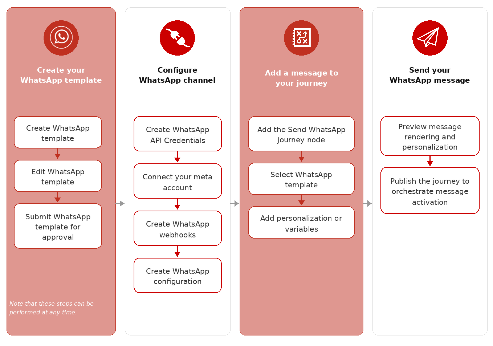

# WhatsApp 채널 구성

Marketo Optimizer는 Meta의 Cloud API를 통해 WhatsApp 메시지를 보냅니다. 마케터가 개인 여정에 대한 WhatsApp 메시지를 만들려면 먼저 제품 관리자가 WhatsApp 채널을 구성해야 합니다.

## 사전 요구 사항 {#prerequisites}

WhatsApp 채널을 구성하기 전에 다음 사항이 있는지 확인하십시오.

* [Meta Business Manager 계정](https://business.facebook.com/)
* [확인된 발신자 이름 및 전화 번호가 있는 WhatsApp 비즈니스 계정](https://developers.facebook.com/docs/whatsapp/overview/business-accounts/)
* [적절한 권한이 있는 Meta 사용자 인증 토큰](https://developers.facebook.com/blog/post/2022/12/05/auth-tokens/)
* [WhatsApp 비즈니스 계정의 승인된 메시지 템플릿](https://developers.facebook.com/docs/whatsapp/message-templates/guidelines/)

>[!IMPORTANT]
>
>WhatsApp 메시징 서비스 사용은 Meta의 약관이 적용됩니다. Marketo Optimizer를 통해 WhatsApp 메시지에 액세스하면 [Meta WhatsApp 비즈니스 정책](https://www.whatsapp.com/legal/business-policy/)을(를) 검토하고 준수하는 데 동의하는 것으로 간주됩니다.

## 제한 사항 {#limitations}

WhatsApp 채널에는 다음 제한 사항이 적용됩니다.

* Adobe Marketo Optimizer가 **HIPAA를 준수하지 않고 HIPAA를 사용할 수 없습니다**. 또한 서드파티 공급업체는 Adobe의 BAA에 포함되지 않습니다. 자체 규정 준수 및 공급업체 유효성 검사에 대한 책임은 고객에게 있습니다.

* 자동화된 응답 메시지나 사전 정의된 응답 메시지는 아직 지원되지 않습니다.

* 2025년 4월부터 Meta은 미국 전화 번호(+1 전화 걸기 코드와 미국 지역 코드로 구성된 번호)가 있는 WhatsApp 사용자에게 모든 마케팅 템플릿 메시지의 게재를 일시적으로 중단했습니다. [Meta 설명서에서 자세히 알아보기](https://developers.facebook.com/documentation/business-messaging/whatsapp/templates/marketing-templates/per-user-limits/)

* 네이티브 통합 기능은 제3자 비즈니스 서비스 제공자(BSP)와의 통합을 허용하지 않습니다.

## 채널 구성 완료 {#complete-channel-configuration}

WhatsApp 메시지를 보내기 전에 Marketo Optimizer 환경을 구성하고 WhatsApp 계정과 연결해야 합니다.

다음 작업을 완료하십시오.

1. [WhatsApp API 자격 증명 만들기](#create-whatsapp-api-credentials)
1. [WhatsApp 웹후크 추가](#configure-webhooks)
1. [WhatsApp 채널 구성 만들기](#create-channel-configuration)

### WhatsApp API 자격 증명 만들기 {#create-whatsapp-api-credentials}

>[!NOTE]
>
>설명된 설정은 관리자 권한이 있는 사용자만 액세스할 수 있습니다.

1. 왼쪽 탐색에서 **[!UICONTROL 관리]** 섹션을 확장하고 **[!UICONTROL 채널]**&#x200B;을 클릭합니다.

1. 패널에서 **[!UICONTROL WhatsApp 설정]**&#x200B;을 확장하고 **[!UICONTROL API 자격 증명]**&#x200B;을 선택합니다.

   {width="800" zoomable="yes"}

1. 오른쪽 상단의 **[!UICONTROL 새 API 자격 증명 만들기]**&#x200B;를 클릭합니다.

1. 아래에 자세히 설명된 대로 API 자격 증명을 구성합니다.

   * **[!UICONTROL 이름]** - 자격 증명의 고유 이름을 입력하십시오.
   * **[!UICONTROL API 토큰]** - API 토큰을 입력하십시오. 자세한 내용은 [Meta 설명서](https://developers.facebook.com/blog/post/2022/12/05/auth-tokens/)를 참조하세요.
   * **[!UICONTROL 비즈니스 계정 ID]** - 비즈니스 포트폴리오와 관련된 고유 번호를 입력합니다. 자세한 내용은 [Meta 설명서](https://www.facebook.com/business/help/1181250022022158?id=180505742745347)를 참조하세요.

   {width="500" zoomable="yes"}

1. **[!UICONTROL 계속]**&#x200B;을 클릭합니다.

1. WhatsApp API 자격 증명에 연결할 **[!UICONTROL WhatsApp 비즈니스 계정]**&#x200B;을(를) 선택하십시오.

   {width="500" zoomable="yes"}

1. WhatsApp 메시지를 보내는 데 사용할 **[!UICONTROL 보낸 사람 이름]**&#x200B;을(를) 선택하십시오.

   전화 번호 설정은 자동으로 채워집니다.

   * **품질 평가** - 지난 24시간 동안 보낸 메시지에 대한 고객 피드백을 반영합니다.
     * 녹색: 고품질
     * 노란색: Medium 품질
     * 빨강: 낮은 품질

     자세한 내용은 Meta 설명서에서 [_품질 등급_](https://www.facebook.com/business/help/766346674749731#)을 참조하세요.

   * **처리량** - 전화 번호에서 메시지를 보낼 수 있는 속도를 나타냅니다.

1. API 자격 증명 구성을 마치면 **[!UICONTROL 제출]**&#x200B;을 클릭합니다.

_[!UICONTROL 제출]_&#x200B;을 클릭하면 자격 증명이 즉시 확인 및 저장되며, _[!UICONTROL API 자격 증명]_ 목록 페이지로 리디렉션됩니다.

제출된 자격 증명이 유효하지 않은 경우 HTTP 500 오류 메시지가 표시됩니다. 이 경우 구성을 취소하거나 업데이트한 다음 다시 제출하도록 선택할 수 있습니다.

+++HTTP 500 오류 문제 해결

WhatsApp API 자격 증명을 구성할 때 HTTP 500 오류가 발생하는 경우 다음 문제 해결 단계를 수행합니다.

1. Adobe 권한 확인 - 조직에서 _cjm_ whatsapp_ 권한이 프로비저닝되었는지 확인합니다. 이 권한이 없으면 WhatsApp 채널을 구성할 수 없습니다.

1. 비즈니스 계정 필드의 유효성 검사 - 모든 필수 필드가 올바른지 확인합니다.

   * API 토큰 - 적절한 권한이 있는 올바른 [Meta 액세스 토큰이어야 합니다](https://developers.facebook.com/blog/post/2022/12/05/auth-tokens/).
   * 비즈니스 계정 ID - [Meta 비즈니스 계정 ID](https://www.facebook.com/business/help/1181250022022158?id=180505742745347)와 정확히 일치해야 합니다.

1. 자격 증명을 외부에서 테스트 - Meta API로 직접 자격 증명을 확인하여 문제가 자격 증명과 관련된 문제인지 Marketo Optimizer 자격 증명 처리와 관련된 문제인지 확인합니다.

1. Adobe에 문의 - 환경 및 권한이 유효하다고 확인되었지만 HTTP 500 오류가 지속되는 경우 Adobe 담당자에게 문의하십시오.

+++

### WhatsApp 웹후크 추가 {#configure-webhooks}

>[!CONTEXTUALHELP]
>id="ajo-b2b-prime_admin-whatsapp-webhook-inbound-keyword-category"
>title="인바운드 키워드 카테고리"
>abstract="<b>옵트인</b>: 사용자가 구독하면 정의된 자동 응답이 전송됩니다.  <b>옵트아웃</b>: 사용자가 구독을 취소하면 정의된 자동 응답이 전송됩니다.  <b>도움말</b>: 사용자가 도움이나 지원을 요청하면 정의된 자동 응답을 보냅니다.  <b>기본값</b>: 키워드와 일치하는 항목이 없을 때 대체 자동 응답을 보냅니다."

>[!CONTEXTUALHELP]
>id="ajo-b2b-prime_admin_whatsapp-webhook-inbound-keyword"
>title="키워드를 입력하십시오."
>abstract="사용자가 입력한 텍스트를 기반으로 특정 자동 응답을 트리거하는 키워드를 정의할 수 있습니다. 키워드는 대소문자를 구분하지 않습니다(stop과 STOP이 동일하게 처리됨)."

>[!CONTEXTUALHELP]
>id="ajo-b2b-prime_admin-whatsapp-webhook-webhook-url"
>title="콜백 URL"
>abstract="이 오브젝트에 대한 유효성 검사 요청과 웹후크 알림은 지정된 URL로 전송됩니다."

>[!CONTEXTUALHELP]
>id="ajo-b2b-prime_admin-whatsapp-webhook-verify-token"
>title="토큰 확인"
>abstract="검증 과정에서 콜백 URL을 확인하고 검증하기 위해 Meta가 다시 반환하는 토큰입니다."

웹후크를 사용하면 Marketo Optimizer가 WhatsApp 비즈니스 계정에서 인바운드 메시지, 동의 응답 및 게재 알림을 받을 수 있습니다. 적절한 동의 관리 및 메시지 추적을 보장하기 위해 웹후크를 구성합니다.

>[!NOTE]
>
>지정된 옵트인 또는 옵트아웃 키워드가 없으면 표준 동의 메시지가 활성화되지 않습니다.

WhatsApp API 자격 증명이 성공적으로 생성되면 웹후크를 구성할 수 있습니다.

1. 탐색 패널에서 **[!UICONTROL WhatsApp 웹후크]**&#x200B;를 선택합니다.

1. **[!UICONTROL Webhook 만들기]**&#x200B;를 클릭합니다.

1. Webhook 구성에 대한 **[!UICONTROL 이름]**&#x200B;을(를) 입력하십시오.

1. **[!UICONTROL 구성]**&#x200B;의 경우 Webhook과 연결할 API 자격 증명(이전 작업에서 생성)을 선택하십시오.

1. **[!UICONTROL 인바운드 키워드 범주]**&#x200B;에 대해 키워드 및 회신 메시지를 정의할 범주를 선택하십시오.

   * **[!UICONTROL 옵트인]** - 사용자는 웹 사이트 또는 앱의 양식을 통해 관리되는 WhatsApp 메시지를 받는 데 적극적으로 동의해야 합니다.
   * **[!UICONTROL 옵트아웃]** - `Stop` 또는 `No Message`과(와) 같은 구문을 수신하도록 웹후크를 구성하여 사용자를 자동으로 옵트아웃으로 표시합니다.
   * **[!UICONTROL 도움말]** - 자동화된 시스템에서 사용자가 `HELP`(또는 `Unknown`과(와) 같은 유사한 키워드)을 보내는 시점을 감지하고 서비스 지침과 같은 특정 정보로 자동으로 회신할 수 있도록 허용합니다.
   * **[!UICONTROL 기본값]** - 특별히 정의된 키워드와 일치하지 않는 수신 메시지를 처리합니다. Adobe Experience Platform 데이터 세트에서 이벤트(열기 및 게재 보고서 등) 추적을 활성화하는 대체 카테고리 역할을 합니다.

   키워드 범주를 선택하면 기본 키워드가 채워집니다.

1. **[!UICONTROL 키워드 입력]**&#x200B;의 경우 사용자 지정 키워드를 입력하고 _추가_( **+** )을 클릭할 수 있습니다.

   카테고리당 여러 키워드를 추가할 수 있습니다.

   >[!NOTE]
   >
   >키워드는 대/소문자를 구분하지 않습니다(`stop` 및 `STOP`은(는) 동일하게 처리됨).

1. 받은 메시지가 이 범주의 키워드와 일치할 때 자동으로 보낼 **[!UICONTROL 회신 메시지]**&#x200B;를 입력하세요.

   {width="500" zoomable="yes"}

1. 구성할 각 추가 키워드 범주에 대해 오른쪽 상단의 _추가_(**+**)를 클릭하고 5-7단계를 반복합니다.

1. **[!UICONTROL 제출]**&#x200B;을 클릭하여 웹후크 구성을 저장합니다.

### 토큰 및 URL 복사 {#copy-token-and-url}

Webhook이 제출되면 토큰과 URL 값을 검색한 다음 Meta에 등록할 수 있습니다.

1. **[!UICONTROL WhatsApp 웹후크]** 목록에서 만든 웹후크의 이름을 클릭합니다.

1. **[!UICONTROL 확인 토큰]** 및 **[!UICONTROL 웹후크 URL]** 값을 복사합니다.

   {width="500" zoomable="yes"}

1. [개발자용 Meta 포털](https://developers.facebook.com/)에서 WhatsApp 응용 프로그램 설정으로 이동하여 복사한 값을 사용하여 웹후크를 구성합니다.

### 채널 구성 만들기 {#create-channel-configuration}

채널 구성은 여정 작업 노드에서 WhatsApp 메시지를 보낼 때 사용되는 게재 설정을 정의합니다.

1. 탐색 패널의 _[!UICONTROL 일반 설정]_&#x200B;에서 **[!UICONTROL 채널 구성]**&#x200B;을 선택합니다.

   {width="600" zoomable="yes"}

1. 오른쪽 상단의 **[!UICONTROL 채널 구성 만들기]**&#x200B;를 클릭합니다.

1. 구성에 대한 **[!UICONTROL 이름]** 및 **[!UICONTROL 설명]**(선택 사항)을 입력하십시오.

   >[!NOTE]
   >
   >이름은 문자(A-Z)로 시작해야 하며 영숫자, 밑줄(`_`), 점(`.`) 및 하이픈(`-`)만 포함할 수 있습니다.

1. **[!UICONTROL 채널 선택]**&#x200B;의 경우 `WhatsApp`을(를) 선택하십시오.

   선택한 마케팅 작업과 연결된 모든 동의 정책은 고객의 선호도를 존중하도록 자동으로 활용됩니다. 예를 들어 여정에서 해당 구성을 사용하는 모든 WhatsApp 메시지는 귀하로부터 WhatsApp 메시지를 수신하는 데 동의한 프로필에만 전송됩니다. 이러한 커뮤니케이션의 수신에 동의하지 않은 프로필은 제외됩니다.

1. _[!UICONTROL WhatsApp 설정]_&#x200B;에서 이전 작업에서 만든 **[!UICONTROL WhatsApp 구성]**(API 자격 증명)을 선택합니다.

1. 메시지 배달에 사용할 **[!UICONTROL 보낸 사람 전화 번호]**&#x200B;을(를) 입력하십시오.

   {width="500" zoomable="yes"}

1. (현재 Marketo Optimizer에 적용할 수 없음) **[!UICONTROL WhatsApp 실행 필드]**&#x200B;의 경우 수신자가 여러 개의 전화 번호를 사용할 수 있을 때 우선 순위 전화 번호로 사용할 프로필 특성을 선택하십시오.

1. **[!UICONTROL 제출]**&#x200B;을 클릭하여 저장하거나 **[!UICONTROL 초안으로 저장]**&#x200B;을 클릭하여 나중에 구성을 완료하고 제출합니다.

유효성 검사를 실행하는 동안 구성이 처음에 _처리 중_ 상태로 표시됩니다. 모든 검사를 통과하면 상태가 **_활성_**(으)로 변경되며 마케터가 여정 작업에서 WhatsApp 메시지를 작성할 때 구성을 선택할 준비가 되었습니다.