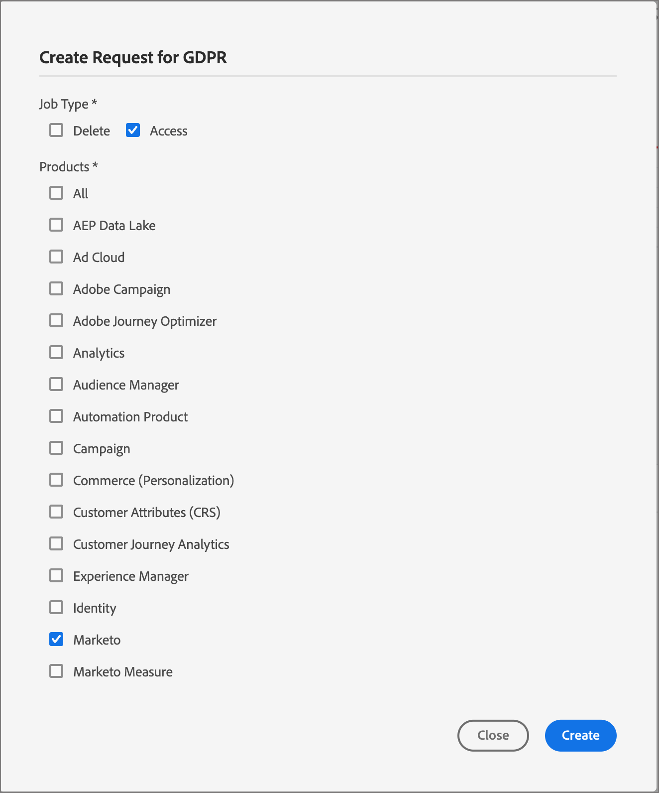

# 개인 정보 관리 {#privacy-management}

[Adobe Experience Platform Privacy Service](https://experienceleague.adobe.com/ko/docs/experience-platform/privacy/home){target="_blank"}은(는) 고객 데이터 요청을 관리하는 데 도움이 되는 RESTful API 및 사용자 인터페이스를 제공합니다. [!DNL Adobe Privacy Service]을(를) 사용하면 Adobe CX 엔터프라이즈 애플리케이션에서 개인 고객 데이터에 액세스하고 삭제하는 요청을 제출할 수 있으므로 법적 및 조직의 개인 정보 보호 규정을 자동으로 준수할 수 있습니다.

[!DNL Adobe Marketo Optimizer]은(는) 글로벌 데이터 보호 요구 사항을 충족할 수 있도록 이러한 개인 정보 보호 도구를 제공합니다. [!DNL Privacy Service]을(를) 사용하여 [!DNL Marketo Optimizer]에서 수집하고 저장하는 데이터에 대한 액세스 및 관리 요청을 제출하고 관리합니다.

다음 두 가지 방법으로 [!DNL Adobe Marketo Optimizer]에서 소비자 데이터에 액세스하고 삭제하도록 개별 요청을 제출할 수 있습니다.

* [!DNL Privacy Service] UI
* [!DNL Privacy Service] API

## 지원되는 개인 정보 보호 규정 {#regulations}

[!DNL Marketo Optimizer] 개인 정보 보호 도구를 사용하면 [!DNL Privacy Service]을(를) 통해 규정을 준수할 수 있습니다. 각 규정은 연결된 지역에 거주하는 사람에 대한 데이터를 보유하고 있는 경우 적용됩니다.

지원되는 규정에 대한 최신 목록을 보려면 Privacy Service 설명서의 [_개인 정보 보호 규정 개요_](https://experienceleague.adobe.com/ko/docs/experience-platform/privacy/regulations/overview){target="_blank"}를 참조하십시오.

## 요청 유형 {#access-and-delete-requests}

[!DNL Marketo Optimizer]은(는) 두 가지 개인 정보 보호 요청 유형을 지원합니다.

* **데이터 액세스** - 사용자는 개인 데이터가 처리 중임을 확인하고 해당 데이터의 무료 전자 복사본을 받을 수 있습니다.
* **데이터 삭제** - _잊혀질 권리_&#x200B;라고도 하는 사용자는 개인 데이터를 지우고 추가 처리를 중지하도록 요청할 수 있습니다.

## 개인 정보 보호 요청 보기 및 관리 {#view-manage-requests}

>[!BEGINSHADEBOX]

 이러한 단계에는 [!DNL Privacy Service] 제품 프로필과 Experience Platform에서 할당된 사용자 역할에 대한 다음 [권한이 필요합니다](../start/user-management.md#permissions):

* **[!UICONTROL Privacy Service 권한]** - `Privacy Read Permission` 및 `Privacy Write Permission`
* **[!UICONTROL 데이터 거버넌스]** - `View Privacy Console`

자세한 내용은 [!DNL Privacy Service] 안내서의 [_Privacy Service에 대한 권한 관리_](https://experienceleague.adobe.com/en/docs/experience-platform/privacy/permissions){target="_blank"}를 참조하십시오.

>[!ENDSHADEBOX]

[!DNL Marketo Optimizer]에서 개인 정보 보호 요청 작업을 보려면 **[!UICONTROL 개인 정보 보호]**&#x200B;를 확장하고 **[!UICONTROL 요청]**&#x200B;을 선택하십시오.

작업을 관리하거나 요청을 제출하려는 규정에 대해 표시된 페이지를 변경하려면 오른쪽 상단의 **[!UICONTROL 규정 유형]** 옵션을 사용하십시오.

{width="800" zoomable="yes"}

### 요청 제출 {#submit-a-request}

1. **[!UICONTROL 요청 만들기]**&#x200B;를 클릭합니다.

1. **[!UICONTROL 작업 유형]**&#x200B;에 대해 요청 유형을 선택하십시오.

   * **[!UICONTROL 액세스]**

     [!DNL Marketo Optimizer]이(가) 포함된 **_액세스_** 요청을 제출하면 [!DNL Privacy Service]이(가) 다음을 반환합니다.

     * [!DNL Marketo Engage] 활동이 잠재 고객과 연결되었습니다.
     * 개인 또는 계정과 연결된 [!DNL Marketo Optimizer] 활동.

   * **[!UICONTROL 삭제]**

     [!DNL Marketo Engage] 및 [!DNL Marketo Optimizer]에 대해 **삭제** 요청을 제출하면 다음 레코드가 제거됩니다.

     * [!DNL Marketo Engage]에 연결된 잠재 고객.
     * [!DNL Marketo Optimizer]에서 만들어진 개인 및 계정 레코드.
     * 개인의 개인 정보를 참조하는 동료 대화 기록.

1. **[!UICONTROL 제품]**&#x200B;의 경우 **[!UICONTROL Marketo]**&#x200B;을(를) 선택하십시오.

   {width="450" zoomable="yes"}

   이 선택 항목에는 [!DNL Marketo Optimizer] 및 [!DNL Marketo Engage] 인스턴스의 데이터가 모두 포함됩니다.

1. 대화 상자 맨 아래로 스크롤하여 데이터에 액세스하거나 삭제하려는 사람의 이메일 주소를 입력합니다.

1. 요청을 제출하려면 **[!UICONTROL 만들기]**&#x200B;를 클릭하세요.

   [!DNL Privacy Service]이(가) 요청 상태를 확인하는 데 사용할 수 있는 요청 ID를 반환합니다.

### API 요청 {#api-requests}

[!DNL Privacy Service] API를 사용하여 개인 정보 요청을 제출할 수도 있습니다. 일반 API 참조에 대해서는 [Privacy Service API 설명서](https://developer.adobe.com/experience-platform-apis/references/privacy-service){target="_blank"}를 참조하십시오.

>[!PREREQUISITES]
>
>요청을 제출하기 전에 다음 정보를 수집합니다.
>
>* 조직의 IMS 조직 ID(`@AdobeOrg`로 끝나는 24자 영숫자 문자열). IMS 조직 ID를 모르는 경우 `gdprsupport@adobe.com`에서 Adobe 지원 센터에 문의하십시오.
>* 액세스하거나 삭제하려는 데이터의 개인 이메일 주소입니다.

요청에서 다음 필드 값을 사용합니다.

| 필드 | 값 |
|---|---|
| `companyContexts.namespace` | `imsOrgID` |
| `companyContexts.value` | IMS 조직 ID |
| `users.action` | `access` 또는 `delete` |
| `users.userIDs.namespace` | `Email` |
| `include` | [!DNL Marketo Optimizer]과(와) [!DNL Marketo Engage] 데이터를 모두 포함하는 `marketo` |
| `regulation` | 예: `ccpa` <br/>일부 규정 값이 상태 약어를 포함하도록 변경됩니다(예: `ucpa_ut_usa`). 이전 값은 전환 기간 동안 계속 유효합니다. 이러한 값에 대한 통합을 구축하기 전에 현재 목록에 대한 [개인 정보 보호 규정 개요](https://experienceleague.adobe.com/ko/docs/experience-platform/privacy/regulations/overview){target="_blank"}를 참조하십시오. |

다음 예제에서는 [!DNL Marketo Optimizer] 데이터를 포함하는 GDPR 삭제 요청을 제출합니다.

```json
{
  "companyContexts": [
    {
      "namespace": "imsOrgID",
      "value": "1231659F56A68A8B7F000101@AdobeOrg"
    }
  ],
  "users": [
    {
      "action": ["delete"],
      "userIDs": [
        {
          "namespace": "Email",
          "type": "standard",
          "value": "john.doe@adobe.com"
        }
      ]
    }
  ],
  "include": ["marketo"],
  "regulation": "gdpr"
}
```

[!DNL Privacy Service]이(가) 다음과 유사한 응답을 반환합니다.

```json
{
  "requestId": "16331241037112570RX-245",
  "totalRecords": 1,
  "jobs": [
    {
      "jobId": "997b01e3-9568-402c-904b-b4e60a437875",
      "customer": {
        "user": {
          "action": ["delete"],
          "userIDs": [
            {
              "namespace": "Email",
              "value": "john.doe@adobe.com",
              "type": "standard",
              "namespaceId": 6,
              "isDeletedClientSide": false
            }
          ]
        }
      }
    }
  ]
}
```
