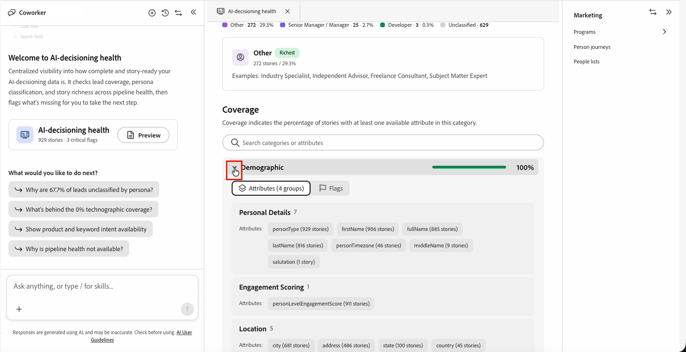

# AI 의사 결정 상태

AI 의사 결정 상태가 [!DNL Adobe Marketo Optimizer]에서 개인화를 지원하는 데이터를 확인합니다. 인구 통계학, 기업 그래픽, 기술 및 심리학 범주 전반에 걸쳐 잠재 고객 범위, 인물 분류 및 스토리 풍부성에 대해 보고합니다. 그런 다음 누락된 데이터에 플래그를 지정하여 어디서부터 시작할지 식별합니다.

AI 의사 결정 상태를 사용하여 [!DNL Marketo Engage]에서 유입되는 데이터와 차이가 있는 위치를 확인합니다. 이러한 간격을 좁히면 [AI 의사 결정](./ai-decisioning.md)이 각 사용자를 평가하고 라우팅하는 방식이 향상됩니다.

## 개방형 AI 의사 결정 상태 {#open}

홈 페이지나 동료 채팅에서 보고서를 엽니다.

* _홈_ 페이지의 빠른 액세스 행에서 **[!UICONTROL AI 의사 결정 상태]** 카드를 선택합니다. 이 카드는 행을 이끌고 929개의 스토리, 32%의 담당자로 분류된 등 스토리 볼륨과 담당자 분류 진행 상황을 보여줍니다.
* 동료 대화 상자에서 개인화 데이터에 대해 직접 묻거나 `/`을(를) 입력하고 **[!UICONTROL AI 의사 결정 상태]**&#x200B;를 선택하십시오.

{width="600"}

두 경로 모두 Coworker 작업 영역 내에서 보고서를 엽니다.

## 채팅 시작 및 후속 프롬프트 {#chat-welcome}

채팅에서 AI 결정 상태를 열면 환영 메시지, _[!UICONTROL *AI 결정 상태 시작]_, 보고서 확인 요약 및 전체 보고서 열기 카드가 표시됩니다.

카드 아래의 _[!UICONTROL 다음 작업을 수행하시겠습니까?]_&#x200B;에서 AI 의사 결정 상태는 사용자 고유의 데이터 격차를 기반으로 후속 프롬프트를 제안합니다. 예를 들어, 잠재 고객의 67.7%가 성향 분류가 부족한 경우, 한 제안된 프롬프트는 _왜 67.7%의 잠재 고객이 성별로 분류되지 않았습니까?_&#x200B;라고 읽습니다. 채팅을 종료하지 않고 직접 답변을 받으려면 제안된 프롬프트를 선택하거나 직접 질문을 하십시오.

{width="800" zoomable="yes"}

## 보고서 개요 {#report-overview}

작업 영역 보고서가 열리고 _인구 통계 데이터가 필드 깊이가 강력한 리드의 100%에 도달하거나_ 또는 _67.7%의 리드가 어떤 성향으로도 분류되지 않은 상태로 남아 있음_&#x200B;과 같이 데이터의 가장 강하고 약한 영역을 일반 언어로 나열하는 **[!UICONTROL 강조 표시]** 설명선이 표시됩니다. 확인 표시는 정상적인 결과를 표시하고, 칠해진 원은 공백을 표시합니다.

강조 표시 옆에 있는 방사형 차트는 인구 통계, 방사형, 기술 정보, 심리 그래프, 성향, 6개 차원에 대한 전체 **[!UICONTROL 적용 범위]**&#x200B;를 표시합니다. 음영 영역이 더 커지면 적용 범위가 더 넓어집니다.

## 사용자 분류 {#persona-classification}

**[!UICONTROL 성향 분류]** 섹션은 성향 분류로 분류된 스토리 수를 보여줍니다. 예를 들어, _929개 스토리 중 &lbrace;300개 · 32.3% 분류 · 67.7% 미분류_. 스택 막대는 사용자별로 분류된 스토리를 나누며, 각 스토리의 수와 백분율을 보여주는 범례가 있습니다.

성향 세그먼트를 선택하여 해당 성향의 직함 예제가 포함된 세부 사항 카드를 엽니다. 예를 들어, **[!UICONTROL 기타]** 세그먼트는 업계 전문가, 독립 고문, 프리랜스 컨설턴트, 주제전문가 등의 예와 함께 _272개 사례 / 29.3%_&#x200B;을(를) 보여줄 수 있습니다.

## 적용 범위 {#coverage}

**[!UICONTROL 적용 범위]** 섹션에는 인구 통계학적, 원시 통계학적, 기술 통계학적, 정신 통계학적, 의도와 활동 등 5개의 데이터 범주가 나열됩니다. 각 카테고리는 해당 카테고리에 사용 가능한 속성이 하나 이상 있는 스토리의 비율을 표시합니다.

범주를 선택하여 확장한 다음 다음 두 탭 중 하나를 선택합니다.

* **[!UICONTROL 특성]** - 개인 세부 정보 또는 인구 통계학적 위치 등 유형별로 그룹화된 특성입니다. 각 특성은 값이 있는 스토리의 수를 표시합니다(예: `firstName (906 stories)`).
* **[!UICONTROL 플래그]** - 해당 범주에 맞는 간격 또는 _이 범주에 열려 있는 플래그가 없습니다_(적용 범위가 정상일 때).

범주 목록 위의 검색 필드를 사용하여 이름별로 범주 또는 속성으로 직접 이동합니다.

{width="800" zoomable="yes"}

## 플래그 {#flags}

보고서 하단의 **[!UICONTROL 플래그]** 섹션에는 모든 범주에서 발견된 모든 격차가 심각도별로 나열되어 있습니다.

* **[!UICONTROL 중요]** - _모든 잠재 고객에 대해 기술 지원 범위가 0%입니다_&#x200B;와 같이 기능을 완전히 차단하는 간격.
* **[!UICONTROL 감시]** - _잠재 고객의 7.2%에 달하는 사이코그래프 범위_&#x200B;와 같이, 효과는 감소하지만 기능은 차단하지 않는 격차입니다.

목록을 심각도로 필터링한 다음 확장할 플래그를 선택하고 비즈니스 영향에 대한 한 문장의 설명을 읽습니다. 예를 들어 _분류되지 않은 잠재 고객은 사용자별 여정을 입력하거나 역할에 맞는 메시지를 받을 수 없으므로 캠페인 관련성과 전환율이 줄어듭니다._

![플래그 섹션이 [보기] 심각도로 필터링되어 세 개의 플래그를 표시하고 하나는 확장하여 비즈니스에 영향을 주는 설명을 표시합니다.](./assets/ai-decisioning-health-flags.png){width="800" zoomable="yes"}

## 최근에 액세스한 날짜 {#recently-accessed}

AI 의사 결정 상태를 연 다음 다른 곳으로 이동하면 빈 작업 영역의 **[!UICONTROL 최근에 액세스함]** 아래에 다시 나타나므로 홈 페이지로 돌아가지 않고 보고서로 다시 이동할 수 있습니다.

{width="500"}

>[!BEGINSHADEBOX]

AI 의사 결정 상태에 대해 계획된 개선 사항은 다음과 같습니다.

* 동료 기술 카탈로그의 전용 항목입니다.
* 플래그 수정을 안내하는 &quot;방법 묻기&quot; 작업
* 전용 다음 단계 탭.

>[!ENDSHADEBOX]
