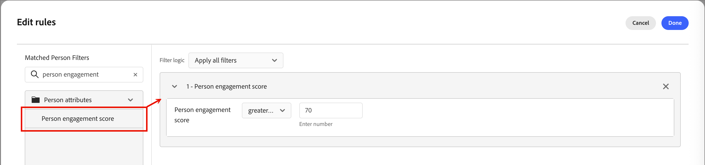
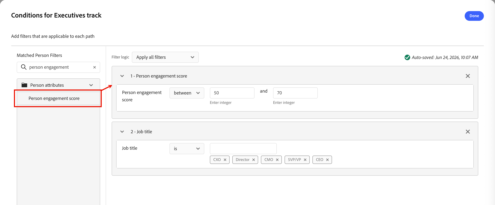

# 개인 참여 점수 {#engagement-scores}

>[!CONTEXTUALHELP]
>id="ajo-b2b-prime_person_engagement_score"
>title="개인 참여 점수"
>abstract="개인 참여 점수는 최근 활동을 기반으로 한 개별 리드의 참여 수준을 반영합니다."

개인 참여 점수는 개별 잠재 고객에 대한 참여 수준을 반영하는 숫자입니다. 점수는 개인이 수행하는 활동을 기반으로 하며, 여기서 각 활동 유형에는 가중치가 적용됩니다. 일관된 비교를 가능하게 하고 실행 가능한 통찰력을 허용하기 위해 인스턴스(테넌트) 내에서 점수가 표준화됩니다.

점수 계산은 매일 실행됩니다. 지난 30일 이내에 개인이 수행한 참여 가중 활동이 점수에 기여합니다. 이 30일 순환 기간을 사용하면 이전 활동 발생이 만료되고 시간이 지남에 따라 점수가 감소할 수 있습니다(점수 감소). 표시된 점수는 반올림됩니다(예: 75.89999 점수가 76으로 표시됨).

참여 점수 데이터는 **[!UICONTROL 보고서]**&#x200B;에서 사용할 수 있습니다.

{width="800" zoomable="yes"}

사용자 참여 점수는 사용자 목록에서 [필터 조건](#engagement-score-filter)(으)로 사용할 수 있고 사용자 여정에서 경로 노드를 분할할 수 있는 특성입니다.

## 참여 점수에 사용되는 활동 {#activities}

참여 점수가 _트리거 기반_&#x200B;이 아닙니다. 모든 리드에 대한 활동을 평가하고 점수를 다시 계산하는 일별 프로세스입니다. 활동은 _가중치_&#x200B;를 사용하여 각 활동 유형이 전체 점수에 기여하는 정도를 결정하는 활성 가중치 모델에 따라 점수를 알립니다.

각 활동 유형에 대한 일일 빈도 상한은 20개입니다. 한 사람이 하루에 동일한 활동을 20번 이상 수행하는 경우 해당 활동에 대한 카운트가 20으로 제한됩니다.

| 활동 이름 | 방향 | 설명 | 기본 가중치 |
|---|---|---|---|
| 회의 참석 | 인바운드 | 고의도의 직접 참여 신호 | 60 |
| 이메일 클릭 | 인바운드 | 활성 클릭 = 의미 있는 참여 | 30 |
| 판매 이메일 클릭 | 인바운드 | 판매 지원 클릭 | 30 |
| Marketo 이메일 클릭 | 인바운드 | 활성 클릭 = 의미 있는 참여 | 30 |
| Concierge 참여 | 인바운드 | 컨시어지 도구를 통한 라이브 참여 | 60 |
| Concierge에서 라이브 채팅 참여 | 인바운드 | 라이브 채팅 = 높은 구매 의도 | 60 |
| Marketo 양식 작성 | 인바운드 | 양식 채우기 = 명시적 리드 의도 | 40 |
| 즐거운 순간 | 인바운드 | 높은 값 동작 트리거 | 60 |
| 새 잠재 고객 | 인바운드 | 진입점 — 기준선 점수 | 30 |
| 이메일 열람 | 인바운드 | 수동 참여, 클릭 미만 | 30 |
| Marketo 이메일 열기 | 인바운드 | 수동 참여, 클릭 미만 | 30 |
| 판매 이메일 열람 | 인바운드 | 수동 참여, 클릭 미만 | 30 |
| WhatsApp 메시지 읽기 | 인바운드 | 수동 읽기, 저용량 채널 | 30 |
| 친구에게 이메일 발송 | 인바운드 | 바이러스 신호; 경증 양성 | 30 |
| 판매 이메일에 회신 | 인바운드 | 직접 회신 = 강한 구매 신호 | 40 |
| 캠페인 요청 | 인바운드 | 자가 주도 작업 — 높은 의도 | 30 |
| Marketo 캠페인 요청 | 인바운드 | 자가 주도 작업 — 높은 의도 | 30 |
| 컨시어지에서 예약된 회의 | 인바운드 | 최고 의도 전환 작업 | 60 |

>[!NOTE]
>
>참여 점수 활동은 개인의 Marketo Engage 활동 로그에 기록됩니다. 연결된 Marketo Engage 인스턴스에서 이 로그에 액세스할 수 있습니다. 자세한 내용은 Marketo Engage 설명서에서 [사용자에 대한 활동 로그 찾기](https://experienceleague.adobe.com/ko/docs/marketo/using/product-docs/core-marketo-concepts/smart-lists-and-static-lists/managing-people-in-smart-lists/locate-the-activity-log-for-a-person){target="_blank"}를 참조하십시오.

## 채점 논리 {#scoring-logic}

시스템은 여러 단계 표준화 프로세스를 적용하여 인스턴스의 모든 리드에 대해 일관된 점수를 생성합니다.

1. 전자 메일 클릭, 양식 채우기, 이벤트 참석 등 가중치와 일일 할당량이 연결된 모든 _참여 가중치_ 활동 유형을 식별합니다.

1. 현재 30일 전환 확인 기간 내에서 개인이 수행한 모든 _참여 가중치_ 작업을 식별합니다.

1. 전환 확인 기간 내에 발생하지 않은 형식을 무시하고 1단계에서 식별된 모든 _참여 가중치_ 활동 유형에서 활동 유형 가중치를 정규화합니다.

   이 단계에서는 _최소-최대 정규화_&#x200B;를 사용하고 대부분의 활동 유형을 사용하지 않는 인스턴스의 활동 유형 가중치의 인위적 희석을 줄입니다.

1. 개인 및 활동 유형당 일일 빈도 상한을 적용합니다.

   이 단계는 전체 점수에 대한 높은 볼륨, 낮은 가치의 활동의 영향을 줄입니다.

1. 활동 유형별 일일 활동을 합산하고, 여기에 관련 가중치를 곱한 다음, 전환 확인 기간의 모든 일에 걸쳐 결과를 합산하여 원시 참여 점수를 계산합니다.

1. 이상값의 영향을 줄여 분산을 안정시키려면 _전원 변환_(제곱근)을 적용합니다.

   이 변환은 왜곡을 줄이고 데이터의 패턴을 더 선형적으로 만든다.

1. 점수가 0에서 100 사이의 전체 범위를 사용하도록 하려면 _크기 조정된 정규화_ 변형을 적용하세요.

## 참여 점수로 필터링 {#engagement-score-filter}

사용자 목록에 대한 대상자를 정의하거나 사용자 여정에서 세그먼트화할 때 개인 참여 점수를 필터로 사용할 수 있습니다.

_[!UICONTROL 개인 참여 점수]_ 필터는 **[!UICONTROL 개인 특성]** 범주 아래의 필터 패널에 표시됩니다.

### 사용자 목록 {#people-lists}

[정적 사용자 목록](./people-lists.md#static-lists)에서 구성원을 관리하거나 [동적 사용자 목록](./people-lists.md#dynamic-lists)에 대한 규칙을 정의할 때, 개인 참여 점수별로 필터링하여 조건에 맞는 사람을 타깃팅할 수 있습니다.

{width="700" zoomable="yes"}

**정적 목록 — 구성원 추가**

1. 정적 목록을 열고 오른쪽 상단에서 **[!UICONTROL 사람 추가]**&#x200B;를 클릭합니다.

1. 필터 대화 상자에서 **[!UICONTROL 사용자 특성]**&#x200B;을 확장하고 **[!UICONTROL 사용자 참여 점수]**&#x200B;를 캔버스로 드래그합니다.

1. 필터 조건에서 연산자를 선택하고 타깃팅하려는 점수와 일치하는 값을 입력합니다.

1. 필터를 적용하고 일치하는 사람을 목록에 추가하려면 **[!UICONTROL 완료]**&#x200B;를 클릭하십시오.

**동적 목록 — 구성원 규칙을 설정합니다**

1. 동적 목록을 열고 **[!UICONTROL 규칙]** 탭을 선택합니다.

1. **[!UICONTROL 규칙 편집]**&#x200B;을 클릭합니다.

1. 필터 대화 상자에서 **[!UICONTROL 사용자 특성]**&#x200B;을 확장하고 **[!UICONTROL 사용자 참여 점수]**&#x200B;를 캔버스로 드래그합니다.

1. 필터 조건에서 연산자를 선택하고 타깃팅하려는 점수와 일치하는 값을 입력합니다.

1. 규칙을 저장하려면 **[!UICONTROL 완료]**&#x200B;를 클릭하십시오.

   개인 레코드가 규칙에 대해 평가되면 멤버십이 자동으로 업데이트됩니다.

### 개인 여정 {#person-journeys}

[_여정 분할_ 노드](../marketing/split-merge-paths-nodes.md)에서 사용자 여정에 대한 세분화를 구성할 때 사용자 참여 점수를 사용자 프로필 필터로 사용하여 경로를 입력하는 사용자를 제어할 수 있습니다.

{width="700" zoomable="yes"}

1. 여정 캔버스에서 **[!UICONTROL 경로 분할]** 노드를 클릭합니다.

1. 오른쪽의 노드 속성 패널에서 경로에 대해 **[!UICONTROL 조건 적용]** 또는 **[!UICONTROL 조건 편집]**&#x200B;을 클릭합니다.

1. 필터 대화 상자에서 **[!UICONTROL 사용자 특성]**&#x200B;을 확장하고 **[!UICONTROL 사용자 참여 점수]**&#x200B;를 캔버스로 드래그합니다.

1. 필터 조건에서 연산자를 선택하고 타깃팅하려는 점수와 일치하는 값을 입력합니다.

1. **[!UICONTROL 완료]**&#x200B;를 클릭하여 경로에 대한 필터를 저장합니다.

## 참여 점수 가중치 구성 {#configure-weighting}

[!DNL Marketo Optimizer]에서 [동료 채팅 인터페이스](../agents/chat-interface.md)에서 직접 참여 점수 가중치를 구성할 수 있습니다.

참여 점수 모델, 가중치 밴드 및 활동 가중치에 대한 배경에 대해서는 [사용자 지정 참여 점수 가중치 구성](https://experienceleague.adobe.com/en/docs/journey-optimizer-b2b/user/admin/configurations/engagement-score-weighting)을 참조하십시오.

1. 화면 왼쪽(채팅 아이콘)에서 **[!UICONTROL 동료]** 채팅 패널을 엽니다.

1. 채팅 입력 필드에 슬래시 명령을 입력한 다음 해당 명령을 입력합니다. 예:

   `/engagement-configuration Configure activity weights for the person engagement score model`

   `/`을(를) 입력할 때 Coworker는 사용 가능한 슬래시 명령 및 스킬 목록을 표시합니다. 참여 구성 명령은 참여 점수 가중치 페이지로 직접 라우팅됩니다.

   {width="700" zoomable="yes"}

1. _제출_(위쪽 화살표) 아이콘을 클릭하거나 Enter 키를 누릅니다.

   동료가 요청을 처리하고 채팅 패널 옆에 있는 기본 콘텐츠 영역에서 **[!UICONTROL 참여 구성]** 탭을 엽니다.

### 참여 점수 가중치 목록 검토 {#review-weighting-list}

탭이 열리면 _참여 점수 가중치_ 페이지에 다음 열이 있는 표에 기존의 모든 채점 모델이 표시됩니다.

| 열 | 설명 |
|---|---|
| **이름** | 모델 이름(세부 정보를 열려면 클릭) |
| **상태** | 활성, 초안 또는 보관됨 |
| **만든 날짜** | 모델이 생성된 시기 |
| **마지막으로 업데이트됨** | 가장 최근 저장 타임스탬프 |
| **마지막으로 업데이트한 사람** | 변경 사항을 마지막으로 저장한 사용자 |

{width="700" zoomable="yes"}

지정된 시간에 **one** 모델만 활성화할 수 있습니다. 현재 활성화된 모델은 모든 참여 점수 계산에 적용됩니다.

### 채점 모델 열기 {#open-scoring-model}

목록에서 모델 이름을 클릭하여 세부 정보 페이지를 엽니다.

세부 사항 페이지에는 다음이 표시됩니다.

* 모델 이름 및 현재 상태 배지(_활성_, _초안_ 또는 _보관됨_)
* 활동 목록을 필터링할 _검색_ 필드
* **[!UICONTROL 참여 활동]**, **[!UICONTROL 가중치]**, **[!UICONTROL 마지막으로 업데이트됨]** 및 **[!UICONTROL 마지막으로 업데이트됨]** 열이 있는 전체 활동 테이블

{width="700" zoomable="yes"}

보관된 모델의 경우 **[!UICONTROL Delete]** 및 **[!UICONTROL Duplicate]**&#x200B;이(가) 오른쪽 위에 표시됩니다. 초안 모델의 경우 **[!UICONTROL 활성화]**&#x200B;도 표시됩니다.

### 초안 모델의 활동 가중치 편집 {#edit-activity-weights}

초안 모델에는 각 참여 활동에 대해 편집 가능한 _[!UICONTROL 가중치]_ 옵션이 있습니다. 가중치를 변경하려면:

1. 목록에서 도면 모델 이름을 클릭합니다.

1. 활동 테이블에서 업데이트할 참여 활동을 찾습니다.

1. 해당 활동에 대한 **[!UICONTROL 가중치]** 아래쪽 화살표를 클릭하고 적절한 가중치 대역을 선택합니다(예: `Important`, `Trivial`, `Minor`, `Normal` 및 `Vital`).

   변경 사항은 자동으로 저장됩니다. 명시적인 저장 작업이 필요하지 않습니다.

>[!NOTE]
>
>활성 또는 보관된 모델을 편집하려면 해당 모델을 복제하여 새 도면 모델을 만든 다음 복제를 편집하고 활성화합니다. 활성 모델은 제자리에서 편집할 수 없습니다.

### 초안 모델 활성화 {#activate-weighting-model}

도면 모델을 활성화하면 이전에 활성화된 모델이 자동으로 보관됩니다. 그러면 새로 활성화된 모델이 모든 향후 참여 점수 계산에 적용됩니다. 초안 모델이 올바른 활동 가중치로 구성된 경우:

1. 목록에서 도면 모델 이름을 클릭합니다.

1. 오른쪽 상단의 **[!UICONTROL 활성화]**&#x200B;를 클릭합니다.

1. 대화 상자에서 확인합니다.

