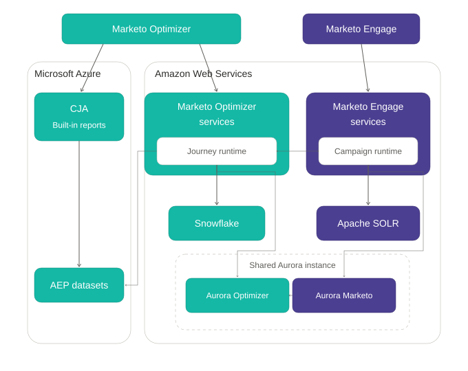

# 고차원의 아키텍처

[!DNL Adobe Marketo Optimizer]은(는) B2B 리드에 대한 360도 보기를 제공하기 위해 [!DNL Adobe Marketo Engage]과(와) 통합됩니다. 양방향 신뢰할 수 있는 동기화는 [!DNL Marketo Engage]과(와) [!DNL Marketo Optimizer]을(를) 일치시켜 두 플랫폼에서 사람, 회사, 사용자 지정 개체 및 활동에 대한 하나의 공유 보기를 제공합니다. 고성능, 거의 실시간으로 생성되는 데이터 흐름을 통해 레코드가 최신 상태로 유지되며 실행 가능하므로 캠페인과 여정이 참여하는 순간에 잠재 고객에 응답할 수 있습니다.

## 데이터 기반

[!DNL Marketo Optimizer]과(와) [!DNL Marketo Engage]은(는) 다운스트림 분석을 제공하는 동안 동기화를 유지하는 공통 데이터 기반을 공유합니다.

두 제품의 서비스, 런타임 및 데이터 저장소가 Microsoft Azure 및 AWS에서 어떻게 연결되는지 보여 주는 

높은 수준에서:

* **[!DNL Marketo Engage]Core**&#x200B;은(는) 리드 및 사용자 지정 개체 데이터의 확실한 소스이며, 캡처 지점에서 데이터 무결성을 보장합니다.
* **Data Broker 계층**&#x200B;은(는) [!DNL Marketo Engage]과(와) [!DNL Marketo Optimizer] 간에 데이터가 이동하는 방식을 조정하여 공유 및 복제된 데이터를 운영 및 사용 준비 환경으로 집계합니다. 이 전체 교환은 단일 공유 AWS Aurora 인스턴스 내에서 실행되며 대규모 B2B 오케스트레이션을 위한 폐쇄 루프 기반을 형성합니다.
* **활동**&#x200B;은(는) 정의된 경로를 따릅니다. 먼저 [!DNL Marketo Engage] 데이터베이스에 기록되고 빠른 제품 내 검색을 위해 Apache SOLR에서 색인화된 다음 [!DNL Marketo Optimizer]이(가) 즉시 인식할 수 있도록 활동 파이프라인에 게시됩니다. 여정 런타임은 해당 활동을 처리하고 Snowflake에 기록하여 운영 데이터를 분석 준비 상태로 변환합니다. 이 단계에서 활동이 [!DNL Adobe Experience Platform]개의 데이터 세트와 [!DNL Adobe Customer Journey Analytics]에 복제되어 보고 기능이 향상됩니다.
* 다양한 엔터티 유형은 시스템 무결성과 신선도 간의 균형을 맞추기 위해 다양한 속도와 방향으로 동기화됩니다.

| [!DNL Marketo Engage] 엔터티 | 동기화 방향 | 지연 |
| --- | --- | --- |
| 리드 | 양방향 | 1초 미만 |
| 회사 | 양방향 | 1초 미만 |
| 사용자 지정 개체 | 단방향 | 5초 미만 |
| 활동 | 단방향 | 5초 미만 |
| 프로그램 멤버십 | 동기화되지 않음 | — |
| 자산 | 동기화되지 않음 | — |

리드와 회사는 중복 데이터 사본을 만들지 않고 양방향으로 즉시 업데이트됩니다. 사용자 지정 개체는 몇 초 내에 복제되므로 [!DNL Marketo Engage]의 스키마 업데이트는 활성 여정에서 즉시 실행할 수 있습니다. 시스템 속도와 무결성을 유지하기 위해 프로그램 멤버십과 Assets이 동기화에서 의도적으로 제외됩니다.

지연 시간이 거의 없는 이 설계는 분석 대시보드 및 다운스트림 시스템이 거의 실시간으로 제공되므로 우선순위가 높은 리드에 대해 라이브 캠페인 최적화 및 신속한 후속 조치를 수행할 수 있습니다.

### 데이터 격리 및 임차인

* 고객 데이터는 제품 데이터 동기화 및 분석 아키텍처의 일부로 [!DNL Marketo Engage], [!DNL Marketo Optimizer] 및 [!DNL Experience Platform] 간에 공유됩니다.
* 데이터는 테넌트별로 논리적으로 격리되며 Adobe 보안 제어에 의해 보호됩니다.
* 데이터는 안전한 암호화 채널을 통해 전송되고 업계 표준 암호화 및 액세스 제어를 사용하여 Adobe 관리 서비스 내에 저장됩니다.
* 보안 및 테넌트 격리를 유지하면서 보고 및 분석 기능을 지원하기 위해 데이터 형식에 따라 정보를 [!DNL Marketo Engage]과(와) [!DNL Marketo Optimizer] 간에 동기화하거나 [!DNL Experience Platform]에 복제할 수 있습니다.
