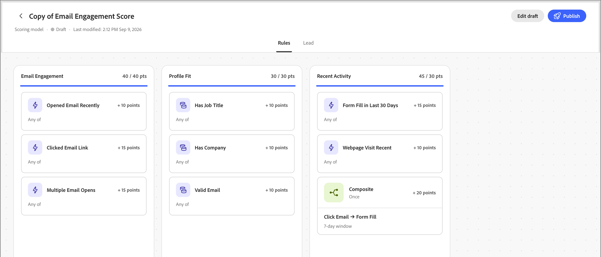
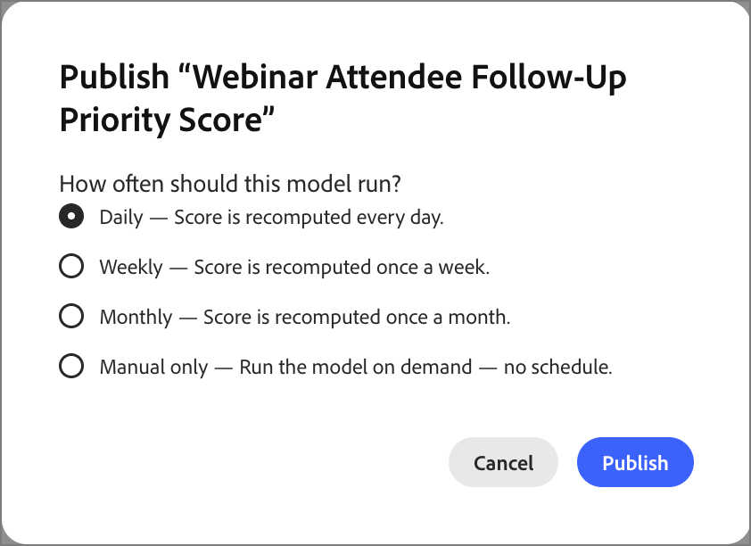

# Scoring Studio

Scoring Studio에는 모델 목록, 각 모델에 대해 편집 가능한 캔버스 및 [동료 채팅 인터페이스](../agents/chat-interface.md)가 포함되어 있습니다. 캔버스를 사용하여 차원 및 신호를 직접 검토하거나 조정할 수 있으며, Coworker에서는 계속해서 자연어 변경 사항을 함께 제안합니다. 프롬프트에서 모델을 만드는 방법에 대한 자세한 내용은 [_사용자 지정 점수 모델 만들기_](../agents/lead-scoring-model.md)&#x200B;를 참조하십시오.

## 모델 목록 {#model-list}

모델 목록은 Scoring Studio의 랜딩 보기입니다. [!DNL Marketo Optimizer] 인스턴스의 모든 채점 모델을 테이블의 행으로 표시하거나, 그리드 보기로 전환하는 경우 카드로 표시합니다.

{width="800" zoomable="yes"}

| 열 | 설명 |
| --- | --- |
| 이름 | 모델 이름을 선택하여 캔버스에서 엽니다. |
| 상태 | _[!UICONTROL 활성]_, _[!UICONTROL 초안]_ 또는 _[!UICONTROL 보관됨]_. |
| 차원 | 모델의 차원 수입니다. |
| 신호 | 모델의 신호 수입니다. |
| 마지막 수정일 | 모델이 마지막으로 변경된 날짜입니다. |
| 마지막 수정자 | 모델을 마지막으로 변경한 사람입니다. |
| 제작일 | 모델이 생성된 날짜입니다. |
| 제작자 | 모델을 만든 사람입니다. |

검색 필드를 사용하여 이름별로 모델을 찾거나 상태별로 목록을 필터링합니다. **[!UICONTROL 편집]**, **[!UICONTROL 복제]**, **[!UICONTROL 보관]** 또는 **[!UICONTROL 삭제]**&#x200B;하려면 행의 **[!UICONTROL 추가 메뉴]**&#x200B;를 선택하세요.

활성 모델은 읽기 전용입니다. 변경하려면 이를 복제하고 복제물을 편집합니다. 그런 다음 원본을 보관하고 수정된 사본을 게시합니다.

## 모델 캔버스 {#model-canvas}

모델 이름을 선택하면 캔버스에서 열립니다. 열려 있는 각 모델은 자체 탭으로 표시되므로 여러 모델에서 작업할 수 있습니다. 캔버스는 **[!UICONTROL 규칙]** 및 **[!UICONTROL 리드]**&#x200B;를 포함한 탭으로 구성됩니다.

**[!UICONTROL 규칙]** 탭에서 모델의 모든 차원은 캔버스의 열입니다. 각 열 머리글에는 치수 이름과 해당 상한선(예: `20 / 30 pts`)에 대한 포인트 합계가 표시되며, 진행률 표시줄이 해당 신호에 포인트로 채워집니다.

{width="700" zoomable="yes"}

각 차원 내에서 모든 신호는 활동에 의존하지 않는 특성 기반 신호에 대해 이름, 점 값 및 일치하는 빈도(예: `1 time / day`) 또는 `Static`를 보여주는 카드로 표시됩니다.

Coworker는 여러 활동의 패턴을 감지하면 모든 조건을 요약하는 단일 복합 신호 카드로 결합할 수 있습니다.

## 신호 구성 {#configure-signal}

신호를 검토하거나 변경하려면 다음 단계를 수행합니다.

1. **[!UICONTROL 초안 편집]**&#x200B;을 선택합니다.

1. 캔버스에서 신호 카드를 선택합니다.

   캔버스의 오른쪽에 속성 패널이 열립니다.

   {width="700" zoomable="yes"}

1. **[!UICONTROL 편집]** 아이콘(  )을 선택한 다음 신호 속성을 업데이트합니다.

   * **[!UICONTROL Signal]**&#x200B;에서 신호 유형(활동 또는 특성)과 신호 유형이 평가하는 특정 활동 또는 특성을 확인합니다.

   * **[!UICONTROL 실행]**&#x200B;에서 일치해야 하는 조건을 설정합니다.

     사용할 항목(예: 특정 페이지)을 추가하고 **[!UICONTROL 임의]** 또는 **[!UICONTROL 모두]** 조건이 true여야 하는지 여부를 지정합니다.

   * **[!UICONTROL 점]**&#x200B;에서 신호가 기여하는 점의 수를 설정하십시오.

     필요한 경우 **[!UICONTROL 상한]**&#x200B;을 설정하여 1인당 기여할 수 있는 포인트 수를 제한하십시오. 동료는 모델의 다른 신호를 기반으로 제안된 점 범위를 보여줍니다.

   * 활동 기반 신호의 경우 신호 시상식 점수 앞에 필요한 **[!UICONTROL 빈도]**&#x200B;를 설정하십시오.

     필요한 경우 설정된 일 수 후에 신호의 포인트를 줄이는 **[!UICONTROL Decay]** 백분율을 설정하십시오.

   * **[!UICONTROL 동일한 작업을 두 번 채점하지 않음]** 옵션을 활성화하여 활동 횟수에 관계없이 한 사람당 한 번만 점수를 부여합니다.

     활동이 대신 발생할 때마다 점수를 부여하는 옵션을 비활성화합니다. 이 설정은 기본적으로 켜져 있습니다.

1. 변경 내용을 적용하고 캔버스로 돌아가려면 **[!UICONTROL 저장]**&#x200B;을(를) 선택하십시오.

## 리드 세그먼트 {#lead-segment}

모든 채점 모델은 Scoring Studio 내에서 정의한 규칙이 아닌 기존 개인 목록에 대한 참조인 1개의 리드 세그먼트에 점수를 매깁니다. 동료가 모델을 만들면 일치하는 목록을 선택하거나 새 모델을 만듭니다.

목록을 변경하려면 **[!UICONTROL 리드]** 탭을 선택한 다음 리드 세그먼트 옆에 있는 **[!UICONTROL 변경]**&#x200B;을 선택하십시오.

{width="700" zoomable="yes"}

리드 세그먼트는 다음 두 가지 목록 유형 중 하나를 사용합니다.

* **정적 목록** — 목록을 만들 때 캡처된 고정된 사용자 집합입니다.
* **스마트 목록** - 모델이 실행될 때마다 멤버 자격 규칙을 다시 평가하는 목록이므로 세그먼트는 항상 목록 기준을 반영합니다.

모델 미리 보기에는 세그먼트 이름, 멤버 수 및 목록을 직접 여는 **[!UICONTROL 사용자 목록 보기]** 링크가 표시됩니다. 목록 관리에 대한 자세한 내용은 [_사람 목록_](../audiences/people-lists.md)&#x200B;을 참조하세요.

참조된 목록이 비어 있거나 나중에 제거되면 모델은 전체 대상자에게 돌아가는 대신 점수를 중지합니다. 유효하고 비어 있지 않은 목록을 할당할 때까지 리드에 점수가 매겨지지 않습니다.

잠재 고객 세그먼트 아래에 **[!UICONTROL 점수 필드 이름]** 카드에 모델이 점수를 쓰는 잠재 고객 특성이 표시됩니다. 기본적으로 필드 이름은 모델의 이름과 일치합니다. 이름을 변경하려면 **[!UICONTROL 편집]**&#x200B;을 선택하세요.

## 게시 및 예약 {#publish-schedule}

모델이 준비되면 **[!UICONTROL 게시]**&#x200B;를 클릭하십시오.

{width="700" zoomable="yes"}

모델이 대상자를 평가하는 빈도를 매일, 매주 또는 매월 중에서 선택합니다. 수동 옵션을 선택하여 모델을 실행할 수도 있습니다.

{width="420" zoomable="no"}

[!DNL Marketo Optimizer]이(가) 채점 필드를 자동으로 프로비저닝하는 방법을 포함하여 [동료 채팅 인터페이스](../agents/chat-interface.md)를 사용한 전체 게시 프로세스에 대해서는 [_채점 모델 게시_](../agents/lead-scoring-model.md#publish-model)&#x200B;를 참조하십시오.

최신 점수는 [!DNL Marketo Engage] 인스턴스에 동기화된 프로비전된 필드에 저장됩니다.

{width="800" zoomable="yes"}

## 필터에서 점수 사용 {#filter-score}

[모델을 게시](#publish-schedule)한 후 이벤트 기반 대상자를 빌드할 때 결과 점수를 필터로 사용하고 _이벤트 수신_ 노드를 분할 경로 조건으로 사용하거나 사용자 목록 멤버십에 사용할 수 있습니다.

점수는 모델 이름 또는 할당한 사용자 지정 [_점수 필드 이름_](#lead-segment)(으)로 레이블이 지정된 **[!UICONTROL 개인 특성]** 범주 아래의 필터 패널에 표시됩니다. 필터 패널의 검색 필드에 해당 이름을 입력하여 점수를 찾은 다음 캔버스로 드래그하여 기준을 정의합니다.

### 이벤트 기반 대상 및 노드 {#scoring-model-event-audience}

채점 모델 결과를 사용하여 [이벤트 기반 대상](../audiences/event-based-audiences.md) 또는 [_이벤트 수신_ 노드](../marketing/listen-for-event-nodes.md)을 필터링하려면:

1. **[!UICONTROL 이벤트 조건 추가]**&#x200B;를 클릭합니다.

1. _[!UICONTROL 이벤트 기준 편집]_ 대화 상자에서 **[!UICONTROL 필터]** 탭을 선택합니다.

1. 검색 필드에 모델 이름을 입력한 다음 점수를 캔버스로 드래그합니다.

   {width="700" zoomable="yes"}

1. 타깃팅하려는 점수와 일치하도록 연산자 및 값을 설정하십시오.

1. **[!UICONTROL 저장]**&#x200B;을 클릭합니다.

### 경로 조건 분할 {#split-path-conditions}

채점 모델 결과를 사용하여 [_분할 경로_ 노드](../marketing/split-merge-paths-nodes.md)에 대한 경로 조건을 정의하려면 다음을 수행하십시오.

1. 노드 경로에 대해 **[!UICONTROL 조건 편집]**&#x200B;을 클릭합니다.

1. _[!UICONTROL 조건]_ 대화 상자에서 검색 필드에 모델 이름을 입력한 다음 일치하는 점수를 캔버스로 드래그합니다.

   {width="700" zoomable="yes"}

1. 타깃팅하려는 점수와 일치하도록 연산자 및 값을 설정하십시오.

1. **[!UICONTROL 완료]**&#x200B;를 클릭하여 경로에 대한 조건을 저장합니다.

### 사용자 목록 멤버십 {#scoring-model-people-lists}

채점 모델 결과를 사용하여 [사람 목록](../audiences/people-lists.md) 멤버십을 관리하려면 다음을 수행하십시오.

**정적 목록 — 구성원 추가**

1. 정적 목록을 열고 **[!UICONTROL 사람 추가]**&#x200B;를 클릭합니다.

1. _[!UICONTROL 사람 추가]_ 대화 상자에서 검색 필드에 모델 이름을 입력한 다음 일치하는 점수를 캔버스로 드래그합니다.

   {width="700" zoomable="yes"}

1. 타깃팅하려는 점수와 일치하도록 연산자 및 값을 설정하십시오.

1. 필터를 적용하고 일치하는 사람을 목록에 추가하려면 **[!UICONTROL 완료]**&#x200B;를 클릭하십시오.

**동적 목록 — 구성원 규칙을 설정합니다**

1. 동적 목록을 열고 **[!UICONTROL 규칙]** 탭을 선택합니다.

1. **[!UICONTROL 규칙 편집]**&#x200B;을 클릭합니다.

1. _[!UICONTROL 규칙 편집]_ 대화 상자에서 모델 이름을 검색 필드에 입력한 다음 점수 항목을 캔버스로 드래그합니다.

   {width="700" zoomable="yes"}

1. 타깃팅하려는 점수와 일치하도록 연산자 및 값을 설정하십시오.

1. 규칙을 저장하려면 **[!UICONTROL 완료]**&#x200B;를 클릭하십시오.

   개인 레코드가 규칙에 대해 평가되면 멤버십이 자동으로 업데이트됩니다.
