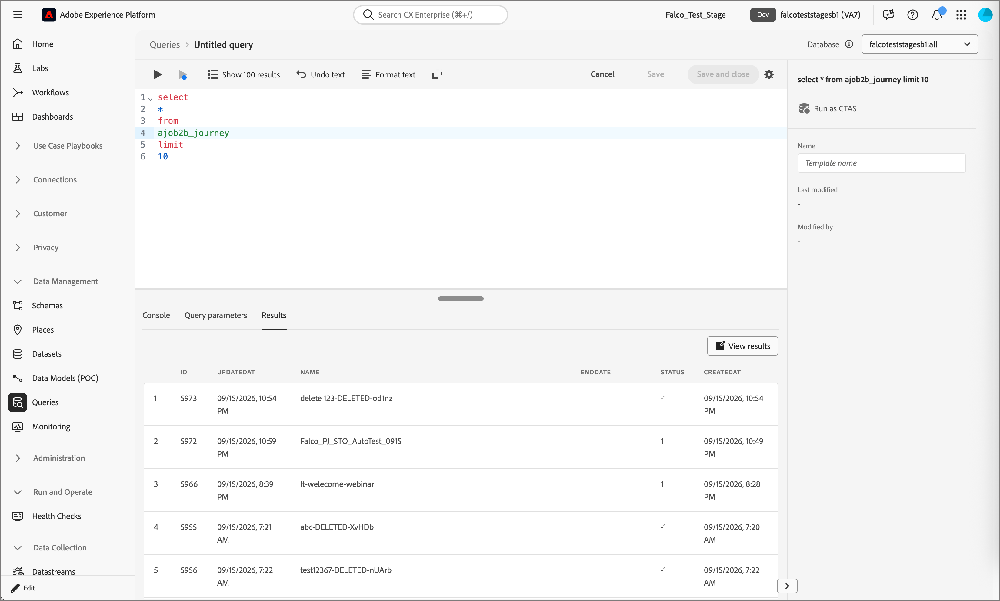

# Experience Platform 데이터 세트

[!DNL Adobe Marketo Optimizer]은(는) 리드, 여정 및 활동 데이터를 [!DNL Adobe Experience Platform] 데이터 세트에 복제합니다. 이러한 데이터 세트는 [!UICONTROL 보고서] 페이지와 포함된 [!DNL Adobe Customer Journey Analytics] 보고서 환경을 지원합니다. Ad Hoc Analysis를 위해 [!DNL Query Service]을(를) 사용하여 직접 쿼리할 수도 있습니다.

데이터 세트는 시스템에서 관리됩니다. [!DNL Customer Journey Analytics]의 연결은 [!DNL Marketo Optimizer] 보고서가 사용하는 데이터 보기에 연결되므로 이 연결을 직접 빌드할 필요가 없습니다. 이 연결은 보고서 섹션에서 **[!UICONTROL CJA에서 분석]**&#x200B;을 선택할 때 도달하는 연결과 동일합니다. [Customer Journey Analytics에서 보고서 분석](./reports-overview.md#analyze-a-report-in-cja)을 참조하세요.

## 사용 가능한 데이터 {#available-datasets}

다음 데이터 세트는 모든 [!DNL Marketo Optimizer] 인스턴스에 대해 채워집니다.

>[!NOTE]
>
>각 데이터 세트 이름은 [!DNL Marketo Optimizer] 데이터의 시스템 이름을 나타내는 접두사 `AJOB2B`을(를) 사용합니다. 이 동작은 예상되며 이러한 이름을 사용하여 [!DNL Experience Platform] 샌드박스에서 데이터 세트를 찾을 수 있습니다.

| 데이터 세트 | 스키마 | 설명 |
| --- | --- | --- |
| `AJOB2B - Person` | 개인 | 표준 잠재 고객 속성. |
| `AJOB2B - PersonActivity` | 개인 활동 | 개인과 연계된 활동 이벤트. |
| `AJOB2B - PersonActivityType` | 개인 활동 유형 | 개인과 연계된 활동 유형. |
| `AJOB2B - PersonActivityTypeEngagementMapping` | 개인 활동 유형 참여 매핑 | 활동 유형을 참여 분류, 채널 이벤트 및 방향에 매핑합니다. |
| `AJOB2B - Journey` | 여정 | 여정 및 해당 라이프사이클 메타데이터 목록입니다. |
| `AJOB2B - JourneyNode` | 여정 노드 | 여정 내 노드 및 관련 메타데이터 목록입니다. |
| `AJOB2B - EngagementAsset` | 참여 자산 | 참여 자산 ID를 통합적으로 조회하고 참여 자산 유형 간에 이름을 표시합니다. |

## 쿼리 서비스로 데이터 세트 쿼리 {#query-service}

[!DNL Customer Journey Analytics] 보고서 외부에서 분석이 필요한 경우 [!DNL Query Service]을(를) 사용하여 이러한 데이터 세트에 대해 임시 SQL 쿼리를 실행합니다. 쿼리 액세스에는 샌드박스에 대한 적절한 [!DNL Experience Platform] 권한이 필요합니다. 일반 쿼리 구문 및 설정에 대해서는 [쿼리 서비스](https://experienceleague.adobe.com/ko/docs/experience-platform/query/home){target="_blank"}를 참조하십시오.

{width="800" zoomable="yes"}

>[!NOTE]
>
>이러한 데이터 세트는 읽기 전용입니다. [!DNL Marketo Optimizer]에서 캡처한 데이터를 변경하려면 데이터 집합을 직접 편집하지 않고 [!DNL Marketo Optimizer] 또는 [!DNL Marketo Engage]에서 원본 데이터를 업데이트하십시오.
