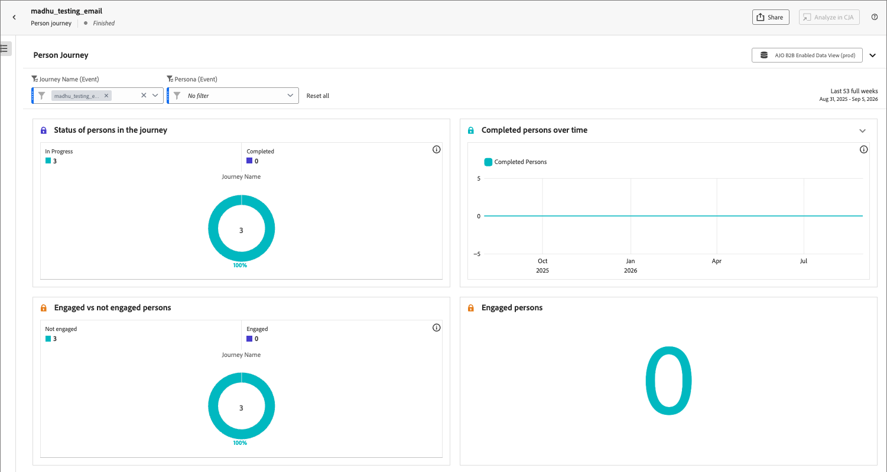
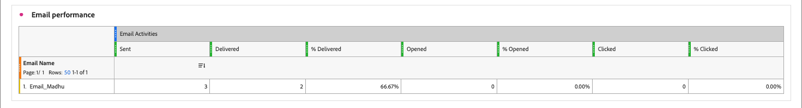

# 개인 여정 개별 보고서

<!-- SPHR-39120: UX plans to move the Journey activity flow tile to the top of the report. Update the tile order in this page when that ships. -->

상태, 참여, 전자 메일 여정 및 활동 흐름을 포함한 성과를 보려면 실시간 또는 완료된 사용자 지표에 대한 **[!UICONTROL 보고서 보기]**&#x200B;를 클릭하십시오.

보고서를 보려면(_T):_

1. _[!UICONTROL 개인 여정]_ 목록에서 **[!UICONTROL Live]** 또는 **[!UICONTROL 완료됨]**&#x200B;명의 여정을 엽니다.
1. 여정 헤더에서 **[!UICONTROL 보고서 보기]**&#x200B;를 선택합니다.

   {width="600" zoomable="yes"}

보고서에 대한 [날짜 범위를 변경](./reports-overview.md#change-the-date-range)할 수 있습니다.

데이터 내보내기를 다운로드하거나 예약하려면 보고서 맨 위에서 **[!UICONTROL 공유]**&#x200B;를 선택하십시오. 보고서 개요에서 [_보고서 내보내기_](./reports-overview.md#export-a-report)&#x200B;를 참조하십시오.

{width="700" zoomable="yes"}

## 필터 {#filters}

보고서 필터의 범위가 현재 여정으로 설정되어 있습니다.

* **[!UICONTROL 여정 이름(이벤트)]** - 보고서를 연 여정으로 미리 설정합니다.
* **[!UICONTROL 성향(이벤트)]** - (_아직 지원되지 않음_) 특정 [파생 성향](../audiences/personas.md#filter-by-derived-persona)과 일치하는 사람에게 보고서를 필터링합니다. 기본값은 [!UICONTROL 필터 없음]입니다.

**[!UICONTROL 모두 재설정]**&#x200B;을 선택하여 _[!UICONTROL 성향(이벤트)]_ 필터를 지우고 기본 보기로 돌아갑니다.

## 개인 상태 및 참여 {#person-status-and-engagement}

이 섹션에는 4개의 타일이 표시됩니다.

* **[!UICONTROL 여정에 있는 사람의 상태]** - 여정에 있는 사람을 _[!UICONTROL 완료됨]_ 및 _[!UICONTROL 진행 중]_ 범주로 분류하며 해당 백분율을 사용합니다.
* **[!UICONTROL 시간 경과에 따른 완료된 사용자]** - 선택한 날짜 범위 동안 여정을 완료한 사용자 수를 추적하는 꺾은선형 차트입니다.
* **[!UICONTROL 참여 사용자 대 미참여 사용자]** - 해당 백분율을 사용하여 여정에 있는 사용자를 _[!UICONTROL 참여]_ 및 _[!UICONTROL 미참여]_ 범주로 분류합니다.
* **[!UICONTROL 참여 사용자]** - 여정에 참여할 자격이 있는 총 사용자 수

## 이메일 성과 {#email-performance}

[!UICONTROL 전자 메일 성능] 표에는 여정에서 보낸 각 전자 메일에 대한 게재 및 참여 지표가 표시됩니다. 모든 여정에서 동일한 전자 메일 지표를 보려면 [전자 메일 참여 보고서](./email-engagement-report.md)를 참조하세요.

{width="700" zoomable="yes"}

[!UICONTROL 전자 메일 성능] 테이블 열:

* [!UICONTROL 전자 메일 이름] - 전자 메일 이름입니다.
* [!UICONTROL 전송됨] - 전송된 전자 메일 수입니다.
* [!UICONTROL 배달됨] - 배달된 전자 메일 수입니다.
* [!UICONTROL % 배달됨] - 배달된 이메일 수를 보낸 횟수로 나눈 값입니다.
* [!UICONTROL 열림] - 받는 사람이 전자 메일을 연 횟수입니다.
* [!UICONTROL % 열림] - 열린 이메일 수를 게재된 수로 나눈 값입니다.
* [!UICONTROL 클릭됨] - 수신자가 전자 메일의 링크를 클릭한 횟수입니다.
* [!UICONTROL % 클릭됨] - 클릭한 이메일 수를 게재된 수로 나눈 값입니다.

## 여정 활동 흐름 {#journey-activity-flow}

[!UICONTROL 여정 활동 흐름] 시각화는 _[!UICONTROL 여정에 사용자 추가]_ 활동에서 시작하여 사용자가 여정을 통해 이동하는 경로를 보여 줍니다. 각 노드에는 해당 활동에 대한 경로 보기 횟수가 표시됩니다.

전자 메일 배달을 통해 [사용자 추가]에서 [여정]로의 경로 보기를 표시하는 {width="700" zoomable="yes"}
