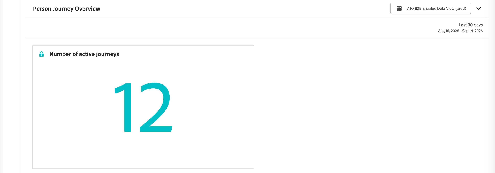

# 개인 여정 개요 보고서

<!-- SPHR-39570: total person journeys by status, People in Live Person Journeys, Person Journey Engagement, Person Journey Entries, Person Journey Failures (SPHR-32522), and the "Journeys by engagement type" and "Completion rate distribution" charts (SPHR-32523) are not documented here pending delivery. File a follow-up documentation ticket when those ship. -->

[!UICONTROL 개인 여정 개요] 보고서를 사용하여 선택한 날짜 범위에 대해 인스턴스 전체에서 활성 개인 여정 수를 볼 수 있습니다.

보고서를 보려면(_T):_

1. 왼쪽 탐색에서 **[!UICONTROL 보고서]**&#x200B;를 선택합니다.
1. _목록_ 아이콘( )을 클릭하고 _[!UICONTROL 목차]_ 패널에서 **[!UICONTROL 개인 여정 개요]**&#x200B;를 선택합니다.

{width="700" zoomable="yes"}

보고서에 대한 [날짜 범위를 변경](./reports-overview.md#change-the-date-range)할 수 있습니다.

모든 보고서 데이터의 내보내기를 다운로드하거나 예약하려면 보고서 맨 위에서 **[!UICONTROL 공유]**&#x200B;를 선택하십시오. 보고서 개요에서 [_보고서 내보내기_](./reports-overview.md#export-a-report)&#x200B;를 참조하십시오.
