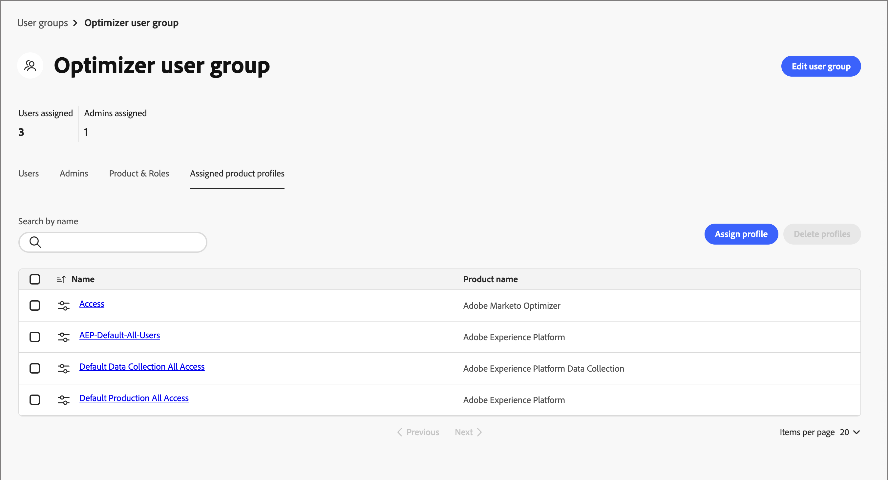
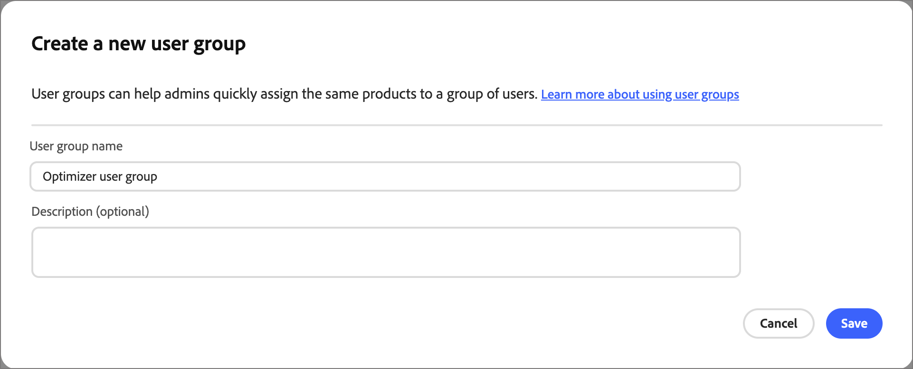

# 사용자 액세스 및 권한

프로비저닝이 완료되고 샌드박스가 바인딩되면 다음 단계를 완료하여 팀 및 사용자에게 [!DNL Marketo Optimizer] 액세스 권한을 제공하십시오.

1. Admin Console에서 [제품 프로필 만들기 [!DNL Journey Optimizer B2B Edition] 제품 프로필 만들기](#create-profile)(1회/초기 설정만 해당).
1. Admin Console에서 [사용자 그룹 추가](#add-user-group).
1. Admin Console의 사용자 그룹에 [제품 프로필을 할당](#assign-profile)합니다.
1. Admin Console에서 [사용자를 새 그룹에 추가](#add-users)합니다.
1. Adobe Experience Platform에서 [기본 제공 역할을 편집](#edit-role-permissions) 또는 [사용자 지정 역할을 만들기](#create-a-custom-role) 권한을 사용하여 [!DNL Journey Optimizer B2B Edition].
1. Adobe Experience Platform의 역할에 [사용자 추가](#add-users-to-a-role) 또는 [그룹](#add-user-groups-to-a-role).

## 제품 프로필 구성 {#config-profile}

관리자는 Adobe 제품 라이선스 및 사용자를 관리하고 관리하는 중앙 위치인 [!DNL Adobe Admin Console]에서 이러한 작업을 완료할 수 있습니다. Admin Console에서는 다양한 개별 솔루션 내부가 아닌 단일 위치에서 사용자를 만들고 관리할 수 있습니다. 기능 및 기능에 대한 자세한 내용은 [Admin Console 개요](https://helpx.adobe.com/business/enterprise/plan-your-deployment/basic-concepts/admin-console.html) 페이지를 참조하세요.

### Admin Console 액세스 {#admin-console}

Admin Console을 사용하여 팀 내의 사용자를 관리하려면 먼저 Admin Console에 액세스할 수 있고 적절한 권한이 있는지 확인해야 합니다.

1. 시스템 관리자는 온보딩 프로세스의 일부로 Adobe에서 여러 개의 이메일을 수신해야 합니다.

   액세스 권한이 부여된 조직 이름에 대한 정보를 제공하는 시작 이메일을 찾습니다.

1. 시작 이메일의 **[!UICONTROL 시작하기]** 링크를 클릭하여 Admin Console으로 이동합니다.

   이메일을 찾을 수 없는 경우 [https://adminconsole.adobe.com](https://adminconsole.adobe.com)에서 Admin Console으로 직접 브라우저를 엽니다.

1. Adobe ID를 사용하여 로그인합니다.

   로그인에 성공하면 Adobe Admin Console의 _개요_ 페이지가 표시됩니다.

1. 여러 조직에 대한 액세스 권한이 있는 경우 올바른 조직에 로그인했는지 확인하십시오.

   조직을 변경하려면 오른쪽 상단에서 조직 이름을 클릭하고 액세스가 필요한 조직을 선택합니다.

1. 시스템 관리자인지 확인하려면 _[!UICONTROL 사용자]_ 카드에서 **[!UICONTROL 관리자]**&#x200B;를 선택하십시오.

   {width="800" zoomable="yes"}

1. Adobe ID 이메일, 사용자 이름, 이름 또는 성을 입력하여 검색합니다.

   * 액세스가 올바르게 구성된 경우 검색은 사용자의 레코드를 반환합니다.

   * **[!UICONTROL 관리자 역할]** 열의 값에 `System`이(가) 표시되면 사용자(또는 표시된 사용자)가 시스템 관리자임을 알 수 있습니다.

### [!DNL Journey Optimizer B2B Edition] 제품 프로필 만들기 {#create-profile}

사용자에게 Adobe 솔루션에 대한 액세스 권한을 부여할 때 반드시 전체 액세스 권한을 부여할 필요는 없습니다. 제품 프로필을 사용하면 각 솔루션이 고유한 사용자 권한 집합을 가질 수 있습니다. Admin Console을 사용하여 제품 프로필을 할당합니다.

사용자 자격에 제품 프로필을 사용하는 방법에 대한 자세한 내용은 Admin Console 설명서에서 [_기업 사용자에 대한 제품 프로필 관리_](https://helpx.adobe.com/business/enterprise/manage-products-and-entitlements/manage-products-and-product-profiles/manage-product-profiles.html){target="_blank"}를 참조하십시오.

{width="30"} 시스템 관리자 또는 [!DNL Experience Platform] 제품 관리자는 [https://adminconsole.adobe.com](https://adminconsole.adobe.com)에서 다음 단계를 수행할 수 있습니다.

1. **[!UICONTROL 제품]** 탭을 선택합니다.

1. 프로필을 추가할 [!DNL Journey Optimizer B2B Edition] 인스턴스를 열고 **[!UICONTROL 새 프로필]**&#x200B;을 클릭합니다.

   {width="600" zoomable="yes"}

1. _B2B 사용자_&#x200B;와 같은 제품 프로필 이름을 입력하십시오.

1. **[!UICONTROL 다음]**&#x200B;을 클릭한 다음 **[!UICONTROL 저장]**&#x200B;을 클릭합니다.

### 사용자 그룹 추가 {#add-user-group}

사용자 그룹은 공유 사용 권한 집합이 부여된 사용자 컬렉션입니다. 사용자 그룹의 사용자를 추가하거나 제거할 수 있습니다. 그룹 내의 사용자가 변경되는 동안 그룹 권한은 동일하게 유지됩니다.

사용자 그룹을 사용하여 권한을 관리하는 방법에 대한 자세한 내용은 Admin Console 설명서에서 [사용자 그룹 관리](https://helpx.adobe.com/business/enterprise/manage-users/user-groups.html){target="_blank"}를 참조하십시오.

{width="30"} 시스템 관리자는 [https://adminconsole.adobe.com](https://adminconsole.adobe.com)에서 다음 단계를 수행할 수 있습니다.

1. **[!UICONTROL 사용자]** 탭을 선택합니다.

1. 왼쪽 탐색에서 **[!UICONTROL 사용자 그룹]**&#x200B;을 선택합니다.

1. 오른쪽 상단의 **[!UICONTROL 새 사용자 그룹]**&#x200B;을 클릭합니다.

1. _B2B 사용자_&#x200B;와 같은 사용자 그룹의 이름을 입력하고 **[!UICONTROL 저장]**&#x200B;을 클릭합니다.

   {width="600" zoomable="yes"}

### 제품 프로필 할당 {#assign-profile}

{width="30"} 제품 관리자는 [https://adminconsole.adobe.com](https://adminconsole.adobe.com)에서 다음 단계를 수행할 수 있습니다.

1. 생성한 사용자 그룹을 클릭합니다.

1. **[!UICONTROL 할당된 제품 프로필]** 탭을 선택하고 **[!UICONTROL 프로필 할당]**&#x200B;을 클릭합니다.

1. **+**&#x200B;을(를) 클릭하고 다음 제품의 각 인스턴스를 추가합니다.

   * [!UICONTROL Adobe Journey Optimizer B2B edition - 사용자 프로필]
   * [!UICONTROL Adobe Experience Platform - AEP-Default-All-Users]
   * [!UICONTROL Adobe Experience Platform 데이터 수집 - 기본 데이터 수집 모든 액세스]
   * [!UICONTROL Adobe Experience Platform - 기본 프로덕션 모든 액세스]

   {width="600" zoomable="yes"}

1. **[!UICONTROL 저장]**&#x200B;을 클릭합니다.

### 새 그룹에 사용자 추가 {#add-users}

사용자 관리에 대한 자세한 내용은 Admin Console 설명서에서 [_Adobe Admin Console 사용자_](https://helpx.adobe.com/business/enterprise/manage-users/users.html){target="_blank"}를 참조하십시오.

{width="30"} 시스템 관리자 또는 제품 관리자는 [https://adminconsole.adobe.com](https://adminconsole.adobe.com)에서 다음 단계를 수행할 수 있습니다. 제품 관리자는 해당 조직에 이미 존재하는 사용자만 추가할 수 있습니다.

1. 사용자가 아직 조직의 멤버가 아닌 경우 각 사용자를 추가합니다.

   * _[!UICONTROL 빠른 링크]_&#x200B;에서 **[!UICONTROL 사용자 추가]**&#x200B;를 클릭합니다.

   * 사용자의 전자 메일 주소를 입력하고 **[!UICONTROL 새 사용자로 추가]**&#x200B;를 클릭합니다.

     {width="600" zoomable="yes"}

   * 이름과 성을 입력한 다음 **[!UICONTROL 저장]**&#x200B;을 클릭합니다.

1. 그룹에 각 사용자를 추가합니다.

   * 사용자 이름을 클릭합니다.

   * 사용자 세부 정보 페이지에서 **[!UICONTROL 사용자 그룹]**(으)로 스크롤합니다.

   * 왼쪽의 _자세히_( **...**) 아이콘을 클릭하고 **[!UICONTROL 사용자 그룹 편집]**&#x200B;을 선택합니다.

   * **[!UICONTROL 사용자 그룹]** 아래의 _추가_( **+**) 아이콘을 클릭합니다.

     {width="600" zoomable="yes"}

   * 이전에 만든 사용자 그룹을 선택하고 **[!UICONTROL 적용]**&#x200B;을 클릭합니다.

   * 사용자 변경 내용을 보려면 **[!UICONTROL 저장]**&#x200B;을 클릭하세요.

## 제품 권한 할당 {#assign-product-permissions}

권한은 제품 프로필에 할당된 권한을 정의할 수 있는 단일 권한입니다. 각 권한은 [!DNL Marketo Optimizer]의 기능을 나타내는 개인 여정 또는 콘텐츠와 같은 기능 아래에 그룹화됩니다.

Adobe Experience Platform의 _권한_ 영역에서 관리자는 사용자 역할과 액세스 정책을 정의하여 제품 응용 프로그램 내의 기능 및 개체에 대한 액세스 권한을 관리할 수 있습니다. 이 앱에서는 역할을 만들고 관리하며, 이러한 역할에 대해 원하는 리소스 권한을 할당할 수 있습니다. 또한 권한을 사용하여 특정 역할과 연관된 샌드박스 및 사용자를 관리할 수 있습니다.

Experience Platform의 역할 권한에 대한 자세한 내용은 Experience Platform 설명서에서 [역할에 대한 권한 관리](https://experienceleague.adobe.com/en/docs/experience-platform/access-control/abac/permissions-ui/permissions){target="_blank"}를 참조하십시오.

1. [experience.adobe.com](https://experience.adobe.com/)&#x200B;(으)로 이동합니다.

1. _[!UICONTROL 빠른 액세스]_ 패널에서 **[!UICONTROL 권한]**&#x200B;을 선택합니다.

   >[!NOTE]
   >
   >_[!UICONTROL 권한]_&#x200B;이 표시되지 않으면 **[!UICONTROL 모두 보기]**&#x200B;를 클릭하고 사용 가능한 응용 프로그램에서 선택해야 할 수 있습니다.

   {width="700" zoomable="yes"}

### 권한 {#permissions}

다음 권한은 [!DNL Marketo Optimizer]의 채널 구성, 콘텐츠 관리 및 개인 여정 기능에 대한 액세스를 제어합니다.

| 카테고리 | 사용 권한 | 설명 |
| -------- | ----------- | ---------- |
| B2B 채널 구성 | B2B 이메일 설정 보기 | 이메일 설정(하위 도메인, PTR 레코드, IP 풀, 제외 목록, 시드 목록, IP 준비 계획) 보기. |
| | B2B 이메일 설정 관리 | 이메일 설정(하위 도메인, PTR 레코드, IP 풀, 제외 목록, 시드 목록, IP 준비 계획)을 구성합니다. 사용자가 이메일을 보낼 수 있으려면 이러한 설정이 필요합니다. |
| | B2B 채널 구성 관리 | 왼쪽 탐색 및 모든 채널 구성 작업에서 _채널_ 메뉴 항목에 액세스합니다. |
| | B2B WhatsApp 사전 설정 관리 | WhatsApp 메시지 사전 설정 및 관련 SMS 설정을 만들고, 보고, 삭제합니다. |
| B2B 여정 | B2B 개인 여정 관리 | _개인 여정_ 목록 및 모든 개인 여정 작업에 액세스합니다. |
| B2B Assets | 콘텐츠 템플릿 보기 | 콘텐츠 템플릿 목록 및 세부 정보를 봅니다. |
| | B2B 템플릿 관리 | 콘텐츠 템플릿을 만들고, 편집하고, 삭제합니다. |
| | B2B 조각 보기 | 콘텐츠 조각 목록 및 세부 정보를 봅니다. |
| | B2B 조각 관리 | 콘텐츠 조각을 만들고, 편집하고, 삭제합니다. |
| | B2B 조각 게시 | 템플릿, 이메일 및 랜딩 페이지에서 사용할 콘텐츠 조각을 게시합니다. |
| | B2B Assets 보기 | Assets 라이브러리 및 자산 파일 세부 사항을 봅니다. |
| | B2B Assets 관리 | 에셋 파일을 만들고, 편집하고, 삭제합니다. |
| | B2B 이메일 보기 | 이메일 메시지를 봅니다. |
| | B2B 이메일 관리 | 이메일 메시지 작성, 편집 및 삭제 |
| | B2B 메시지 내보내기 관리 | 이메일 섹션 아래에서 메시지 보고서를 내보냅니다. |
| Journey Optimizer 라이브러리 | B2B 라이브러리 항목 관리 | 라이브러리에 저장된 표현식을 추가하고 삭제합니다. |
| 데이터 거버넌스 | B2B 관리 사용 레이블 삭제 | 데이터 세트 및 스키마에 적용된 DULE(데이터 사용 레이블)를 보고, 만들고, 삭제합니다. |
| 샌드박스 관리 | B2B 패키지 관리 | 샌드박스 패키지 만들기, 내보내기, 가져오기, 복사 및 삭제 |

[!DNL Marketo Optimizer]에서 외부 대상을 지원하려면 다음 권한이 필요합니다.

| 카테고리 | 사용 권한 | 설명 |
| -------- | ----------- | ---------- |
| 대시보드 | 표준 대시보드 보기 | _프로필_, _대상_ 및 _세그먼트_ 대시보드에 대한 보기 전용 액세스입니다. 왼쪽 탐색 영역에서 _대시보드_&#x200B;에 액세스하고 _대시보드_ 인벤토리 및 통합 탭에 액세스할 수도 있습니다. |
| | 표준 대시보드 관리 | Data Warehouse에 아직 없는 사용자 지정 특성을 추가합니다. |
| 대상 | 대상 보기 | _카탈로그_ 탭에서 사용 가능한 대상 및 _찾아보기_ 탭에서 인증된 대상을 볼 수 있는 보기 전용 액세스입니다. |
| | 대상 관리 | 대상 연결 및 대상 계정을 보고, 만들고, 삭제합니다. |
| | 대상 활성화 | 활성 대상에 데이터를 활성화합니다. 이 기능에 액세스하려면 _대상 보기_ 또는 _대상 관리_&#x200B;도 필요합니다. |
| | 매핑 없이 세그먼트 활성화 | 매핑 단계를 표시하지 않고 기존 대상에 대상을 활성화합니다. 사용자는 활성화 워크플로에서 대상을 추가하거나 제거할 수 있지만 매핑된 속성 또는 ID를 추가하거나 제거할 수 없습니다. 이 함수에 액세스하려면 _대상 보기_ 권한도 필요합니다. |
| | 데이터 세트 대상 관리 및 활성화 | 데이터 세트 내보내기 흐름을 보고, 만들고, 편집하고, 비활성화할 수 있을 뿐만 아니라 데이터를 활성 데이터 세트로 활성화할 수 있습니다. 이 함수에 액세스하려면 _대상 보기_ 권한도 필요합니다. |
| | 대상 작성 | Adobe Experience Platform Destination SDK을 사용하여 대상을 작성할 수 있습니다. |
| 데이터 거버넌스 | 데이터 사용 정책 보기 | 조직에 속한 데이터 사용 정책에 대한 보기 전용 액세스입니다. |
| | 데이터 사용 정책 관리 | 데이터 사용 정책을 보고, 만들고, 편집하고, 삭제합니다. |
| 데이터 수집 | 소스 보기 | _카탈로그_ 탭의 사용 가능한 소스와 _찾아보기_ 탭의 인증된 소스에 대한 보기 전용 액세스 권한입니다. |
| | 소스 관리 | 소스를 보고 만들고 편집하고 비활성화합니다. |
| 프로필 관리 | 프로필 설정 보기 | 모든 프로필 설정에 대한 보기 전용 액세스 권한. |
| | 프로필 설정 관리 | 모든 프로필 설정을 보고 편집합니다. |

<!--

### B2B built-in roles {#b2b-built-in-roles}

When your organization has [!DNL Journey Optimizer B2B Edition] provisioned, Experience Platform includes a set of built-in (default) roles that you can use to manage access to the product capabilities:

| Role | Permissions |
| ---- | ----------- |
| B2B Journey Manager | <li>Manage B2B Journeys <li>Manage B2B Buying Groups <li>Manage B2B Account Lists <li>View B2B Engagement Dashboard <li>View B2B Insights Dashboard |
| B2B Channel Manager | <li>Manage B2B Assets <li>Manage B2B Templates <li>Manage B2B Fragments |
| B2B System Administrator | <li>Manage B2B Channels Configurations <li>Manage B2B Admin Configurations |
| B2B Sales User | <li>View B2B Engagement Dashboard <li>View B2B Buying Groups <li>Access In-CRM Insights |

-->

### 역할 권한 편집 {#edit-role-permissions}

기본 제공 또는 사용자 지정 역할의 경우 언제든지 권한을 추가하거나 삭제할 수 있습니다. 기본 또는 사용자 정의 역할을 수정하는 경우 해당 역할에 할당된 모든 사용자에게 영향을 줍니다.

>[!IMPORTANT]
>
>[!DNL Marketo Optimizer] 액세스를 사용하려면 명명 규칙(Marketo Engage 구독 접두사 + Prime)을 사용하여 프로비저닝된 특정 샌드박스를 활성화해야 합니다. 예를 들어 연결된 Marketo Engage 구독 접두사가 _AcmeAssoc_&#x200B;인 경우 [!DNL Marketo Optimizer] 액세스에 필요한 샌드박스는 _AcmeAssocPrime_&#x200B;입니다.

>[!NOTE]
>
>Admin Console 시스템 관리자는 다음 단계를 수행할 수 있습니다.

:_역할에 대한 권한을 변경하려면(_T)

1. 왼쪽 탐색에서 **[!UICONTROL 역할]**&#x200B;을(를) 선택합니다.

1. **_B2B 채널 관리자_** 역할 이름을 클릭합니다.

1. 세부 정보 페이지에서 오른쪽 상단의 **[!UICONTROL 편집]**&#x200B;을 클릭합니다.

   {width="800" zoomable="yes"}

   역할 편집기에서 _[!UICONTROL 리소스]_ 메뉴에 Experience Cloud - 플랫폼 기반 애플리케이션에 적용되는 리소스 목록이 표시됩니다.

1. [!DNL Marketo Optimizer] 액세스(`<Marketo subscription prefix>Prime`)에 대해 프로비전된 샌드박스를 선택하십시오.

   {width="800" zoomable="yes"}

1. 각 B2B 리소스에 대해 _추가_ 아이콘(**+**)을 클릭합니다.

   {width="700" zoomable="yes"}

1. 각 리소스에 대한 특정 권한을 추가하거나 **[!UICONTROL 모두 추가]**&#x200B;를 선택합니다.

1. **[!UICONTROL 저장]**&#x200B;을 클릭합니다.

   <!-- {width="700" zoomable="yes"} -->

1. 세부 정보 페이지로 돌아가려면 **[!UICONTROL 닫기]**&#x200B;를 클릭하십시오.

### 역할에 사용자 추가 {#add-users-to-a-role}

{width="30"} 시스템 관리자 또는 Experience Platform 관리자는 다음 단계를 수행할 수 있습니다.

1. 역할 세부 정보를 열고 **[!UICONTROL 사용자]** 탭을 선택합니다.

   이 탭에는 역할에 할당된 모든 사용자 목록이 표시됩니다.

1. **[!UICONTROL 사용자 추가]**&#x200B;를 클릭합니다.

   {width="800" zoomable="yes"}

1. _[!UICONTROL 사용자 추가]_ 대화 상자에서 역할에 추가할 사용자를 찾아 선택합니다.

   * 검색 도구를 사용하여 사용자 목록을 필터링할 수 있습니다.

   * 각 사용자에 대한 확인란을 선택합니다.

   {width="600" zoomable="yes"}

1. 추가할 모든 사용자를 선택한 경우 **[!UICONTROL 저장]**&#x200B;을 클릭합니다.

### 역할에 사용자 그룹 추가 {#add-user-groups-to-a-role}

사용자 관리에 대한 자세한 내용은 Admin Console 설명서에서 [_Adobe Admin Console 사용자_](https://helpx.adobe.com/business/enterprise/manage-users/users.html){target="_blank"}를 참조하십시오.

{width="30"} 시스템 관리자 또는 Experience Platform 관리자는 다음 단계를 수행할 수 있습니다.

1. 역할 세부 정보를 열고 **[!UICONTROL 사용자 그룹]** 탭을 선택합니다.

   이 탭에는 역할에 할당된 모든 사용자 그룹 목록이 표시됩니다.

1. **[!UICONTROL 그룹 추가]**&#x200B;를 클릭합니다.

   {width="800" zoomable="yes"}

1. _[!UICONTROL 그룹 추가]_ 대화 상자에서 역할에 추가할 그룹을 찾아 선택합니다.

   * 검색 도구를 사용하여 사용자 그룹 목록을 필터링할 수 있습니다.

   * 각 사용자 그룹에 대한 확인란을 선택합니다.

   {width="600" zoomable="yes"}

1. 추가할 모든 그룹을 선택한 경우 **[!UICONTROL 저장]**&#x200B;을 클릭합니다.

### 사용자 정의 역할 만들기 {#create-a-custom-role}

{width="30"} 시스템 관리자 또는 Experience Platform 관리자는 다음 단계를 수행할 수 있습니다.

1. 왼쪽 탐색에서 **[!UICONTROL 역할]**&#x200B;을(를) 선택하고 **[!UICONTROL 역할 만들기]**&#x200B;를 선택합니다.

1. _[!UICONTROL 새 역할 만들기]_ 대화 상자에서 _B2B 마케터_&#x200B;와 같은 역할 이름과 설명(선택 사항)을 입력합니다.

1. **[!UICONTROL 확인]**&#x200B;을 클릭합니다.

1. [!DNL Marketo Optimizer] 액세스(`<Marketo subscription prefix>Prime`)에 대해 프로비전된 샌드박스를 선택하십시오.

   {width="800" zoomable="yes"}

1. B2B 제품 권한 추가:

   역할에 대해 원하는 제품 기능을 확인하려면 [제품 권한](#permissions) 목록을 참조하세요.

   왼쪽의 _[!UICONTROL 리소스]_ 목록에서 B2B 항목을 찾은 다음 _추가_(**+**) 아이콘을 클릭하여 역할에 사용할 각 특성을 추가합니다.

   검색 도구에 _B2B_&#x200B;을(를) 입력하여 많은 B2B 제품 권한 목록을 필터링할 수 있습니다.

   {width="700" zoomable="yes"}

1. 오른쪽 상단의 **[!UICONTROL 저장]**&#x200B;을 클릭합니다.

1. 역할 세부 정보로 이동하여 **[!UICONTROL 사용자 그룹]** 탭을 선택합니다.

1. **[!UICONTROL 그룹 추가]**&#x200B;를 클릭합니다.

1. 이전에 Admin Console에서 만든 사용자 그룹 옆의 확인란을 선택합니다.

1. **[!UICONTROL 저장]**&#x200B;을 클릭합니다.

사용자 지정 역할이 구성되었으며 할당된 그룹의 사용자가 이제 선택한 [!DNL Marketo Optimizer] 기능에 액세스할 수 있습니다.
